# FPDS Admin User Manual

FPDS Admin is an operations interface for collecting official financial product information and checking collection results and evidence. Products are automatically approved when the required facts are verified, or automatically excluded when the requirements are not met.

**Daily checks:** Overview → Runs → Banks

**Product collection:** Banks → Collect → Check results in Runs

**Historical review records:** More tools → Review history

## 1. Login and Working Country

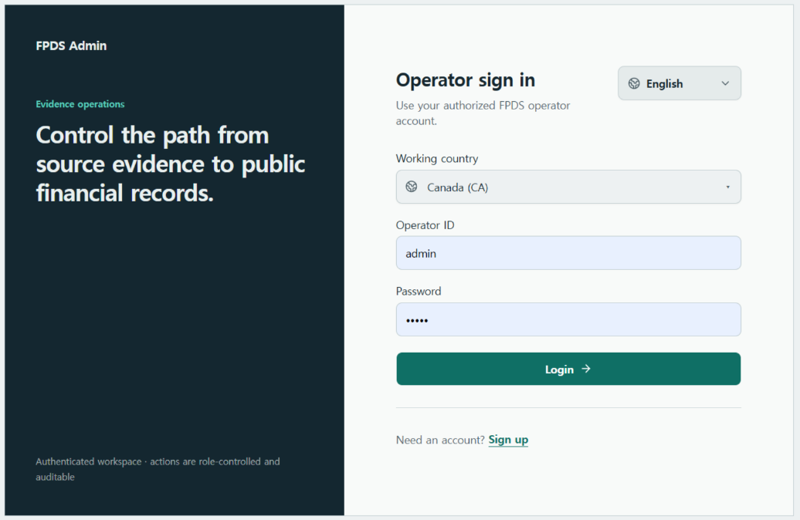

1. Select the country you will work with under **Working country**.
2. Enter your **Operator ID** and **Password**, then click **Login**.
3. If you do not have an account, apply through **Sign up**. You can use the account after an administrator approves your registration.

After logging in, use the country menu at the top right to change the working country. Confirm the change to open that country's Overview. Bank, collection, product, and historical review data are shown for the selected country. Check the country and environment indicator before taking action.

Change the UI language using the language menu on the login screen or the account menu at the bottom left after logging in. Korean, English, and Japanese are supported. Product names, official source text, and manually entered content remain in their original language.

Use the account menu to log out.

## 2. Overview — What Needs Attention

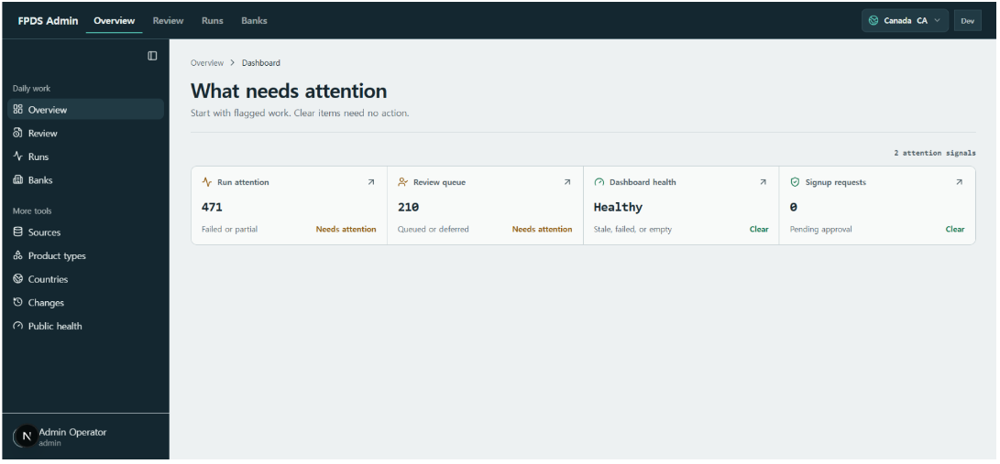

Click a card marked **Needs attention** to open the relevant work.

| Card | What to check |
|---|---|
| Run attention | Failed or partially completed collection runs |
| Dashboard health | Stale, failed, or empty public data |
| Signup requests | Operator registration requests awaiting approval — administrators only |

**Clear** means that the check currently requires no action. An unavailable result or unknown value does not mean zero issues or a healthy state.

Use **More tools → Public Health** to inspect public projection refresh status and failures. Historical product review records are available separately under **More tools → Review history**.

Product collection does not create manual approval tasks. Operator registration approval remains an administrator responsibility.

## 3. Banks — Registering Banks and Collecting Products

### Find or Register a Bank

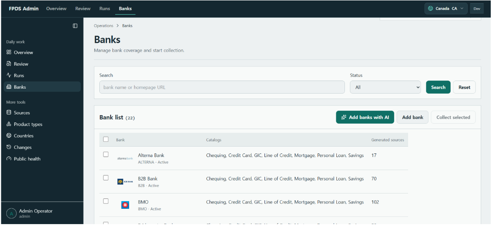

- Use **Search** to find a bank by name or homepage URL.
- Click **Add bank**, enter the bank name, official homepage, language, and status, and select the product types to collect under **Initial coverage**.
- Click a bank name to open its details. After editing the information, click **Save bank**.

**Coverage** means the product types to collect for a particular bank. For example, RBC Chequing and RBC Savings are separate collection scopes.

The public product count in Banks reflects products currently eligible for display in Public. Find it next to **Generated sources** and refresh it with **Search**.

### Add Banks with AI

Administrators can select **Add banks with AI**, choose the number of banks to add from **1 to 10**, and click **Research and add banks**. At least one active Product Type is required.

Check each result's bank name, official homepage, ranking evidence, and Coverage.

The AI research process has two roles:

- **Bank ranking research:** Find banks not yet registered in the selected country using current, credible size rankings.
- **Official source verification:** Check each bank's official name, homepage, and product pages. Add only Coverage supported by official evidence, and use a logo when it can be verified.

Duplicate banks are excluded. If the full requested number of banks cannot be verified with sufficient evidence, no banks are added.

Registering banks does not collect or publish their products. Start collection separately after registration.

### Collect Products

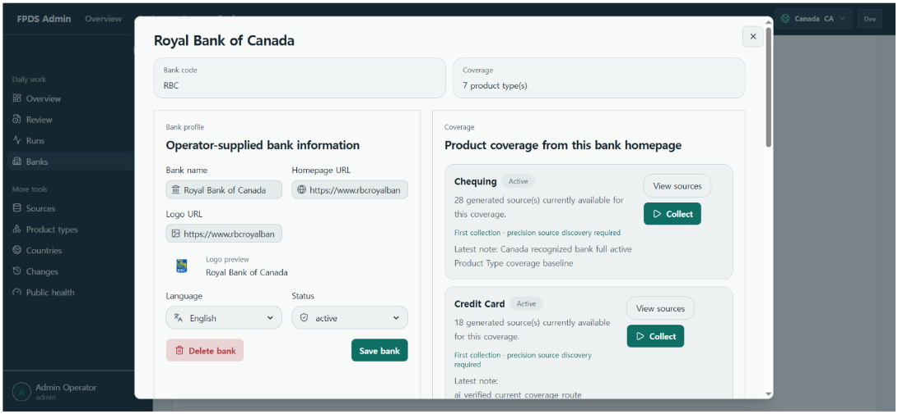

1. Find the product type to collect in the bank detail window. Add Coverage if needed, and check that the scope is active.
2. Click **Collect** for that type. To collect from multiple banks, select them in the list and use **Collect selected**.
3. Check the response for the actual number of Runs created and any skipped scopes or exclusion reasons.
4. Open **Runs** to check the outcome. **View sources** shows the sources for the selected bank and product type.

| Collection method | Behavior |
|---|---|
| First collection | Performs in-depth discovery of product and supporting evidence pages before collection. This applies when the scope has no completed collection history, even if sources already exist. |
| Normal collect | Uses the current active sources for a scope with completed collection history. |
| Detailed collect / Precision source rediscovery | Searches again for new products and changed evidence pages, including for scopes with completed collection history. |

During collection, AI checks official product pages for names, rates, fees, and conditions and extracts values supported by evidence. If a product path cannot be found, it may research the current official path. Document retrieval, parsing, normalization, and validation also use ordinary processing rules.

Candidates then pass through automatic validation. Verified candidates are automatically approved; candidates that fail the required checks are automatically excluded, with the reason recorded in Runs.

Do not start a duplicate run for a scope already in progress. Restore an inactive scope before collecting it. There is no automatic scheduled collection.

### Delete a Bank

**Delete bank** removes the bank and its administrative Coverage and generated sources. Deletion is blocked if collected runtime data or publication history already exists.

## 4. Runs — Checking Collection Results and Errors

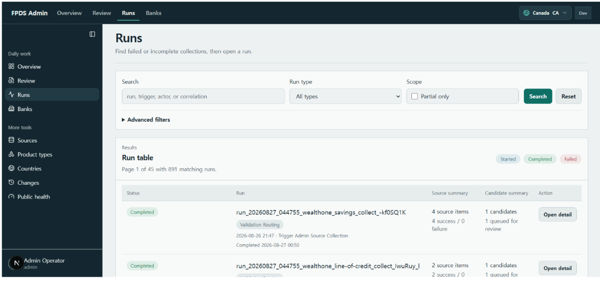

Requested runs appear before source discovery begins. Check the bank, product type, and status, such as **Queued**, **Discovering sources**, **Collecting**, **Skipped**, **Completed**, or **Failed**.

1. Search for a run, or use **Partial only** to find partially completed runs. Use **Advanced filters** to narrow the results by status, date, and other criteria.
2. Click **Open detail** to inspect successful and failed sources, generated candidates, automatic exclusion reasons, and errors.
3. Identify the cause of a failure. If **Retry run** is available, retry only the relevant permitted scope and open the new linked run.

**Auto refresh** updates the list every **15 seconds**. Refresh pauses while you enter filters, while a dialog is open, or while an operation is being processed. **Advanced filters** is collapsed by default; **Search** also refreshes the results.

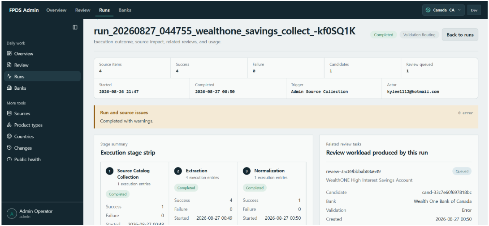

Use the **Execution stage strip** to see how far the run progressed. Check source processing results and candidate outcomes. Where AI execution information is available for extraction or validation, you can also inspect the model processing status.

**Completed means the run has finished. It does not mean every candidate was approved.** Source processing can succeed while a candidate is excluded for insufficient required evidence. Check warnings and automatic exclusion reasons along with the final run status.

Missing optional information is omitted. Do not interpret it as zero, false, or “no conditions,” and do not retry solely to fill optional gaps.

Retries create linked replacement Runs and preserve the original failure history. If the same problem recurs, stop bulk retries until the cause is resolved.

## 5. Review History — Viewing Historical Records

Open **More tools → Review history** to inspect past collection review records.

### Find a Historical Record

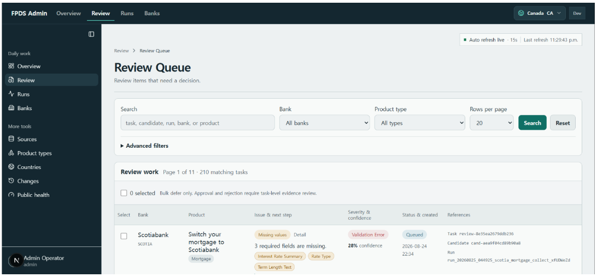

1. Narrow the list by bank, product type, search term, or historical state.
2. Check the product, issue summary, status, and recorded date.
3. Open the record to inspect its historical evidence and decision.

Past queued or deferred states describe historical records. They are not a work queue for approving new collection candidates.

### Inspect Evidence and Past Decisions

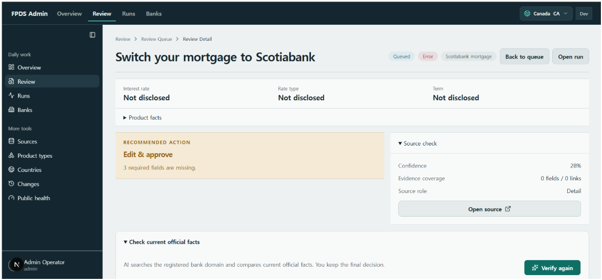

Check the recorded product and bank, working country, collected facts, source evidence, past decision, and linked Run. Follow available source and Run links to understand how the historical record was produced.

The screen does not provide **Approve**, **Edit & approve**, **Defer**, **Reject**, bulk actions, or manual AI verification and correction. New collection does not create Review tasks, and an operator cannot manually approve a candidate to bypass automatic validation.

Do not interpret **Not disclosed** or **Unverified** as zero or an absence of conditions.

## 6. Sources — Checking Collection Evidence

Open **More tools → Sources**.

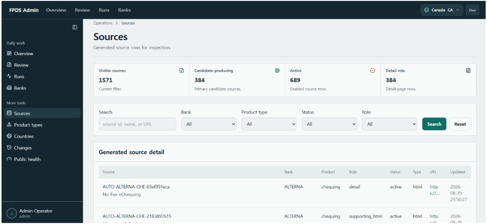

Search by bank, product type, status, or role, then click a source name to open its details.

| Source role or indicator | Meaning |
|---|---|
| `detail` | A page containing an individual product's information; the main source for a product candidate |
| `supporting_html` / `supporting_pdf` | Supporting evidence such as rate tables, fee schedules, and terms |
| Candidate-producing | Indicates whether the source is used to create product candidates |

Supporting pages provide evidence for products. They do not create independent products by themselves.

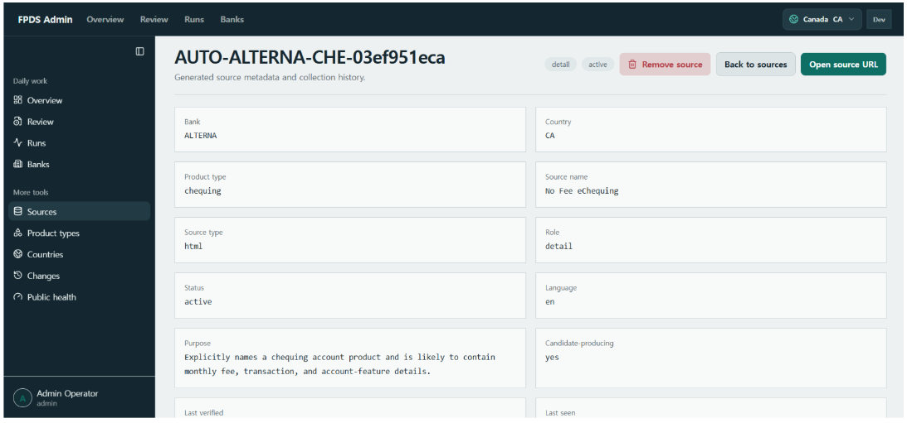

Use **Open source URL** to view the official material. Check the source's role, status, and collection history to understand which official material supports the extracted or verified values.

An administrator's **Remove source** action marks the source as `removed` and excludes it from future collection. Past run and candidate records remain available.

## 7. Product Types — Managing What to Collect

Open **More tools → Product Types**.

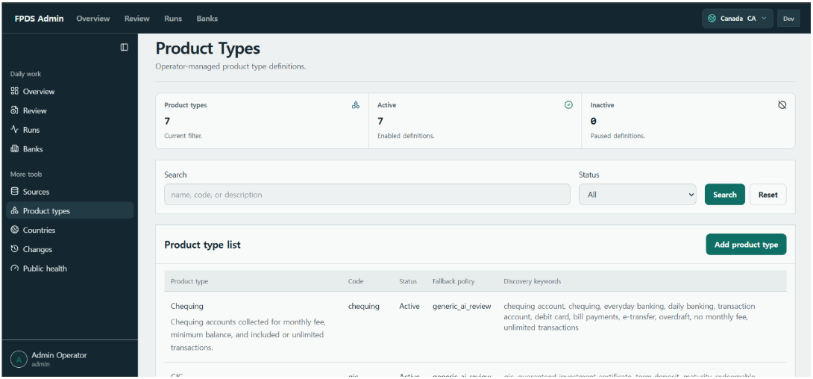

Use **Add product type** to create a type. Click an existing type to edit its code, display name, description, or status, then click **Save product type**.

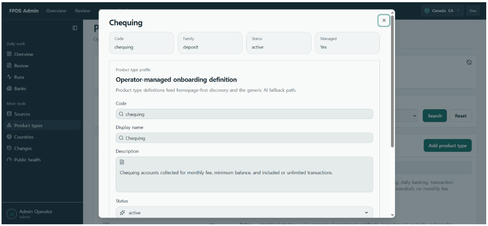

Product type definitions and **Discovery keywords** help determine which product pages are found. You can inspect the keywords and **Fallback policy** in the detail screen.

`generic_ai_review` is a retained compatibility policy name. It does not enable manual product review; current collection still ends in automatic approval or exclusion.

### Manage Collection Fields

In the type's details, administrators can manage additional fields for the current working country as **required**, **optional**, or **excluded from the collection target list**.

- Common essential financial requirements, including protected identity and currency requirements, cannot be disabled.
- Settings apply to the working country and the next collection.
- If evidence for a required fact is missing, the candidate is automatically excluded.
- Verified optional facts found in the same official evidence are preserved. Unknown optional facts are omitted.
- Missing optional information does not trigger extra searches, recollection, manual review, or a ranking penalty.
- Read-only users can inspect the settings.

Adding a product type does not mean its products meet publication requirements. A type referenced by Coverage or sources cannot be deleted.

## 8. Countries — Managing Available Working Countries

Open **More tools → Countries**. This tool is available to administrators only.

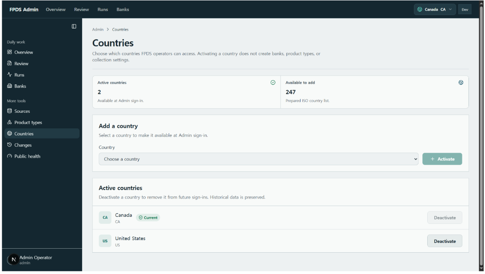

- **Activate a country:** Select it under **Country**, then click **Activate**.
- **Deactivate a country:** Click **Deactivate** in the active country list. Historical data is preserved.
- The current working country and the last remaining active country cannot be deactivated.

Activating a country makes it available at login and in the country switcher. It does not automatically create banks, product types, or collection settings, and it does not start AI collection.

## 9. Changes — Checking Product Change History

Open **More tools → Changes** and search by bank, product type, date range, or other available filters.

Check which fields changed in an approved product, including their previous and new values. Follow linked Runs and any historical Review records to understand the reason for the change.

## 10. AI Processing and Automatic Approval

1. **Banks: Collect** starts the requested collection.
2. Official materials are discovered, collected, and parsed.
3. AI extracts product facts and checks them against captured official evidence.
4. The system normalizes values and validates product identity, currency, required facts, data types, and financial meaning.
5. Candidates that pass are **automatically approved** and stored as canonical product data; approved eligible data is reflected through the Public projection.
6. Candidates that do not pass are **automatically excluded**, with reasons recorded in Runs.

AI supports research, extraction, and comparison. Backend validation rules determine acceptance and store the results. An AI confidence score cannot replace official evidence or bypass those rules.

Optional facts supported by the same evidence are preserved. Uncertain optional facts are omitted. Do not invent missing values or turn them into zero, false, or an arbitrary currency, rate, or term. Preserve the actual rate conditions, fee conditions, and term boundaries.

Captures, evidence, and operational records are private. Public reads only approved active projections and does not expose original evidence or internal diagnostic information.

## Reference — Permissions and Error Handling

Read and write access follows the role and country in the current session. Administrative changes, collection actions, retries, country management, and account approvals require the appropriate permissions. `read_only` users do not change data.

| Situation | Action |
|---|---|
| 401 or an expired session | Log in again and check the working country. |
| 403 or CSRF rejection | Check the session and permissions. Keep authentication and protection controls enabled. |
| Collection failure | Record the Run ID, failed stage, error, and affected scope. Diagnose the cause and retry only as needed. |
| Logout failure | Retry. If it continues, ask the responsible person to confirm whether the session has been revoked. |

Follow the [Operations Handbook](05-operations-handbook.md) for incident, account, and recovery procedures. The recipient's environment, account revocation, backup/restore, UAT, and cutover approval are separate checks in the [Handover Guide](README.md).
