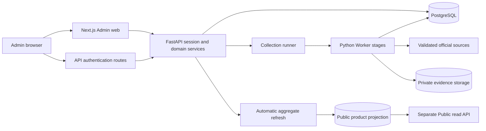

# FPDS Admin 개발 인계 가이드

문서 ID: FPDS-ADMIN-DEV · 한국어 초안 v1 · 기준일: 2026-10-06 (America/Vancouver)

대상은 FPDS Admin 개발을 인계받아 AI 코딩 도구로 변경을 구현하는 개발자다. 이 문서와 연결된 스킬을 사용해 개발 환경을 준비하고, 변경 위치를 찾고, 금융·보안 계약을 지키며, 테스트와 인계 기록까지 남길 수 있어야 한다. 영어 번역은 후속 작업이며 코드 식별자, 경로, 명령과 스킬 이름은 번역하지 않는다.

이 문서는 현재 저장소를 읽어 작성한 개발 안내다. 로컬 코드, 배포된 프로세스, 실제 공개 데이터는 각각 확인해야 한다. 문서 작성으로 배포·데이터 이전·UAT·Production GO가 완료되지 않는다.

## H01. 개발 범위와 문서 권한

인계 대상은 Admin web, Admin API, 수집 runner/Worker, PostgreSQL migration, 비공개 evidence storage와 관련 shared 계약이다. 별도 Public 앱의 UI·운영 인수는 이번 범위 밖이다. Admin 변경이 Public projection 계약에 영향을 주면 API의 Public 읽기 회귀를 확인하고, Public 코드 변경이 필요한 경우 해당 범위를 Product Owner와 확정한다.

문서 권한은 최신 Product Owner 지시 → 요구사항 → 계획 → WBS → 결정 로그 → RAID → 상세 설계 순서다. 이 가이드와 스킬은 그 기준을 찾아 적용하는 안내이며 새로운 제품 권한을 부여하지 않는다.

이전 문서에는 수동 상품 검토, 80% 신뢰도 기준, 벡터 검색, 예약 수집 또는 현재보다 큰 필수 필드 집합이 남아 있다. 현행 기준은 자동 승인/제외, metadata 기반 evidence 검색, 운영자가 시작하는 수집, 타입별 보호된 금융 필수 조건이다. 해당 문구를 발견하면 최신 정책·문서 상단 변경 기록·실행 코드를 대조한다. 보안이나 금융 필수 조건의 충돌을 임의로 완화하지 않는다.

항상 유지할 제품 경계:

- 일반 업무는 Overview → Runs → Banks다. Review는 More tools의 읽기 전용 과거 기록이며 상품 승인·수정 승인·보류·AI 재검증 기능을 복원하지 않는다.
- 상품수집은 공식 근거와 자동 검증으로 승인하거나 제외한다. AI 신뢰도는 근거를 대신하지 않는다. 가입 승인과 계정·보안 승인은 별도로 유지한다.
- 수집·재시도는 인증된 운영자의 명시적 action으로 시작한다. 수집 내부 자동 처리와 Public aggregate refresh는 유지하되 예약 수집이나 영구 recovery 메뉴를 추가하지 않는다.
- 새 국가/상품 유형의 등록 가능성이 해당 시장의 수집·공개 승인을 뜻하지 않는다. 개인화 추천, Public 원본 근거 노출, billing, BX-PF 실 write-back은 별도 범위 결정 없이 구현하지 않는다.

## H02. 첫 개발 세션의 읽기 순서

먼저 [AGENTS.md](../AGENTS.md), [루트 README](../README.md), [개발 일지](../docs/00-governance/development-journal.md), [문서 지도](../docs/README.md)를 읽는다. 날짜별 결과는 그 시점의 증거이며 현재 운영 상태나 상품 수로 사용하지 않는다.

그다음 작업에 필요한 문서만 선택한다.

| 작업 | 필수 출발점 |
|---|---|
| Admin 화면·상호작용 | [Admin README](../app/admin/README.md), [설계 지도](../docs/03-design/README.md), [디자인 시스템](../docs/03-design/fpds-design-system.md), [프런트엔드 기준](../docs/03-design/fpds_design_system_stripe_benchmark.md), [Admin IA](../docs/03-design/admin-information-architecture.md), [언어 정책](../docs/03-design/localization-governance-and-fallback-policy.md) |
| API·인증·권한 | [API README](../api/service/README.md), [인터페이스 계약](../docs/03-design/api-interface-contracts.md), [보안 설계](../docs/03-design/security-access-control-design.md) |
| 수집·금융 필드 | [Worker README](../worker/README.md), [수집 정확성 정책](../docs/03-design/collection-accuracy-policy.md), [금융 필드 계약](../docs/03-design/financial-product-field-contract.md) |
| DB·저장소 | [DB README](../db/README.md), [migration 기준](../docs/03-design/db-migration-baseline.md), [DB 인계 목록](../00-Scope/database-migrations-schema-erd.md), [storage README](../storage/README.md), [보존 정책](../docs/03-design/bounded-data-retention-policy.md) |
| 제품 동작·승인 기준 변경 | [요구사항](../docs/02-requirements/FPDS_Requirements_Definition_v1_5.md), [범위 기준](../docs/02-requirements/scope-baseline.md) |
| 새 개발 slice 선택·순서 변경 | [계획](../docs/01-planning/plan.md), [WBS](../docs/01-planning/WBS.md) |
| 아키텍처·위험·외부 의존성 | [결정 로그](../docs/00-governance/decision-log.md), [RAID](../docs/00-governance/raid-log.md) |
| CI·검증 도구 변경 | [harness 기준](../docs/00-governance/harness-engineering-baseline.md) |

vendor 유래 UI를 직접 바꾸면 [adoption log](../docs/03-design/shadcnblocks-adoption-log.md), [block inventory](../docs/03-design/shadcnblocks-block-inventory.md), [override register](../docs/03-design/ui-override-register.md)를 추가로 읽는다. 지표·시각화를 바꾸는 경우 설계 지도에서 해당 metric/visualization 계약을 더 읽는다. archive는 특정 과거 결정이나 증거를 검증할 때만 연다.

## H03. 시스템 구조와 요청 흐름



Admin 페이지의 서버 읽기와 내부 mutation proxy는 Python API를 호출한다. 브라우저 인증은 허용된 API origin과 cookie 계약을 따른다. 따라서 현재 인증 호출을 모두 same-origin proxy로 바꾸는 전제를 세우지 않는다. DB 연결, raw storage 접근과 금융 판정은 서버/Worker의 책임이다.

| 구성요소 | 기술·역할 | 핵심 진입점 |
|---|---|---|
| Admin web | TypeScript, Next.js App Router, React, Tailwind, Radix/shadcn 계열 UI | [route manifest](../app/admin/routes.manifest.json), [Admin shell](../app/admin/src/components/fpds/admin/admin-shell.tsx), [API client](../app/admin/src/lib/admin-api.ts) |
| API | Python, FastAPI, psycopg; 세션·권한·국가 scope·업무 서비스 | [main.py](../api/service/api_service/main.py), [auth.py](../api/service/api_service/auth.py), [config.py](../api/service/api_service/config.py) |
| Collection runner | API 측 수집 계획과 Worker subprocess 조정 | [catalog runner](../api/service/api_service/source_catalog_collection_runner.py), [source runner](../api/service/api_service/source_collection_runner.py), [essential research](../api/service/api_service/collection_evidence_research.py) |
| Worker | 공식 source 발견, capture, parse/chunk, evidence 검색, 추출, 정규화, 검증 | [discovery](../worker/discovery), [pipeline](../worker/pipeline) |
| DB | SQL-first migration, jsonb 금융 payload와 version 이력 | [migrations](../db/migrations), [API DB 접속](../api/service/api_service/db.py) |
| Shared 계약 | config, security, domain, design, i18n, observability | [shared 지도](../shared/README.md) |
| Storage | private S3-compatible evidence 계약 | [object layout](../storage/object-layout.example.json) |

API 프로젝트와 루트 Worker 프로젝트는 독립 Python 환경이다. runner는 루트 프로젝트에서 Worker 단계를 실행한다. API 테스트를 루트 Worker 환경에서만 실행하면 API에 없는 패키지를 우연히 사용할 수 있다. 현재 API는 beautifulsoup4를 선언하고 PDF 파싱용 pypdf는 루트 Worker 의존성이다. API가 parser identity만 필요하면 [dependency-free version 모듈](../worker/pipeline/fpds_parse_chunk/version.py)을 사용한다.

## H04. 개발 환경 준비와 첫 실행

### H04.1. 인수자가 준비할 것

확정된 source commit/tag, 의뢰자 개발 환경의 PostgreSQL과 private storage, 개발용 자격증명, 테스트 계정 또는 bootstrap 권한을 받아야 한다. 외부 서비스 소유권은 [서비스·계정 대장](../00-Scope/external-services-and-accounts.md)으로 확인한다. 실 credential이나 DB URL은 채팅·Git·개발 문서에 적지 않는다.

현재 선언된 기준은 Python 3.12 이상, uv, Node 24 계열(CI 기준), Admin package의 pnpm 10.33.0이다. 정확한 의존성은 pyproject/lockfile와 package.json/pnpm-lock.yaml을 따른다. Next/React 선언에 latest가 있어도 개발 인계 중 임의로 최신 버전으로 갱신하지 않는다.

제품을 수집 중인 기존 workspace에서는 install/build, process 재시작, tmp/evidence 삭제를 수행하지 않는다. 인수 개발과 전체 검증은 별도 clone에서 실행한다. 아래 명령은 인수자가 준비한 격리 개발 clone의 루트 기준이다.

```powershell
git status --short
git rev-parse HEAD
uv sync --frozen
uv sync --directory api/service --frozen
pnpm --dir app/admin install --frozen-lockfile
```

### H04.2. 설정 파일

[개발 환경 예제](../.env.dev.example), [운영 환경 예제](../.env.prod.example), [Admin web 예제](../app/admin/.env.example), [환경 계약](../docs/03-design/dev-prod-environment-spec.md)을 확인한다. 기존 설정 파일이 없을 때만 예제를 복사한다.

```powershell
if (-not (Test-Path -LiteralPath '.env.dev')) {
    Copy-Item -LiteralPath '.env.dev.example' -Destination '.env.dev'
}
if (-not (Test-Path -LiteralPath 'app/admin/.env.local')) {
    Copy-Item -LiteralPath 'app/admin/.env.example' -Destination 'app/admin/.env.local'
}
```

예제는 placeholder이며 그대로 서비스할 수 없다. 연결 대상은 의뢰자 dev DB/storage인지 확인하고 실제 비밀값은 승인된 local secret store 또는 untracked env 파일에 넣는다.

| 설정 그룹 | 개발자가 확인할 의미 |
|---|---|
| FPDS_ENV / FPDS_ENV_FILE | 환경 표시와 서버 설정 파일 선택; Admin 환경 badge는 API 세션 값을 사용 |
| FPDS_ADMIN_WEB_ORIGIN / FPDS_ADMIN_API_ORIGIN / allowed origins | 기본 로컬 web 3001, API 4000; 브라우저 인증 CORS와 cookie 범위 정합 |
| FPDS_DATABASE_URL / FPDS_DATABASE_SCHEMA | 의도한 격리 PostgreSQL과 schema |
| FPDS_ADMIN_SESSION_SECRET / FPDS_ADMIN_CSRF_SECRET | 개발 전용 서로 다른 실제 secret |
| FPDS_OBJECT_STORAGE_* / FPDS_STORAGE_* | private 저장소와 환경 prefix, 최소 접근 권한 |
| FPDS_SOURCE_FETCH_* / FPDS_SOURCE_BROWSER_* | 공식 domain allowlist, private network 차단, timeout, browser 실행 환경 |
| FPDS_LLM_* | 수집 모델과 provider 설정; 실행 전 비용·quota와 저장 설정 우선순위 확인 |
| FPDS_BXPF_MODE | 개발에서는 mock; 실 write-back은 별도 승인 대상 |

현재 예제에 남은 vector 설정만 보고 pgvector/embedding 저장소를 새로 구성하지 않는다. migration 0040 이후 실행 기준은 metadata-scored retrieval이며 제거된 구조는 [보존 정책](../docs/03-design/bounded-data-retention-policy.md)을 따른다.

### H04.3. DB와 테스트 계정

신규 dev DB는 [DB README](../db/README.md)의 전체 migration 순서를 따른다. 기존 shared DB에는 일괄 재적용하지 않는다. 현재 source에 0047이 있으며, 0044/0046까지만 기록한 인계 목록은 날짜별 관찰이다. SQL 파일, 실제 적용 이력, 실제 schema를 함께 대조한다. 빈 registry를 자동 seed할 것으로 기대하지 않는다.

migration 적용, seed/import와 계정 생성은 상태 변경이다. 대상 dev DB와 허용 작업이 확정된 경우에만 실행한다. 첫 admin 생성 명령은 다음과 같다. 비밀번호는 CLI의 숨김 입력으로 받으며 명령줄에 넣지 않는다.

```powershell
Push-Location api/service
try {
    uv run python -m api_service.bootstrap_admin_user --env-file ..\..\.env.dev --login-id admin --display-name "Admin Operator" --role admin
}
finally {
    Pop-Location
}
```

이 CLI는 첫 계정 생성용이다. 계정 회수·비밀번호 복구의 완성된 운영 도구가 있다고 가정하지 않는다. 로그인에는 활성 국가가 필요하므로 승인된 dev registry 상태도 확인한다.

### H04.4. 서버 실행

API와 Admin web을 별도 터미널에서 실행한다. API는 repo-root-relative env 파일을 읽는다.

```powershell
# 터미널 1: 격리 clone 루트
$env:FPDS_ENV_FILE = '.env.dev'
uv run --directory api/service uvicorn api_service.main:app --reload --host localhost --port 4000
```

```powershell
# 터미널 2: 같은 clone 루트
pnpm --dir app/admin run dev
```

API health는 http://localhost:4000/healthz, 로그인은 http://localhost:3001/admin/login 이다. dev 표시, 국가 선택, 정상 로그인과 로그아웃을 확인한다. 수집 전 health의 collection process/accuracy/profile 식별자와 실제 Run에 기록된 식별자를 대조한다. 단순 health 응답은 전체 수집 경로의 성공을 증명하지 않는다.

일반 Admin 수집은 Banks action으로 API runner가 Worker 단계를 호출한다. 인수를 이유로 임의의 Worker daemon이나 예약 작업을 추가하지 않는다. pipeline CLI는 단계 진단용이며 persist 옵션이나 collection action은 DB/storage 쓰기와 provider 비용을 발생시킬 수 있다.

## H05. 화면과 코드 변경 위치

| 운영 화면·동작 | 먼저 볼 파일 또는 영역 | 유지할 동작 |
|---|---|---|
| Login / Signup | src/app/admin/login, src/app/admin/signup, src/lib/admin-auth-client.ts | 활성 국가 필수, signup은 승인 전 접근 요청, 안전한 return URL |
| Overview | src/app/admin/page.tsx, Admin 도메인 컴포넌트 | 실패/partial Run의 중복 없는 집계, 가입 요청과 Public health 진입 |
| Runs / Run detail | run-status-surface.tsx, run-detail-surface.tsx, API run_status.py/run_retry.py | queued/discovering/collecting/skipped 표현, 원래 실패 이력 보존, 자동 제외 사유 |
| Banks / coverage / collection | bank-registry-surface.tsx, bank-coverage-section.tsx, API source_catalog.py/catalog_preparation.py | session-country, 첫 수집 precision discovery, 활성 coverage, 실제 run_ids |
| Product Types | product-type-collection-fields.tsx, API product_types.py, shared Worker field policy | 국가별 required/optional targets, 보호된 대체/조건부 금융 essentials |
| More tools | reviews, sources, changes, countries, health route | Review read-only, Sources 직접 create/update 405, Countries admin-only |
| 화면 shell·언어·proxy | admin-shell.tsx, admin-i18n.ts, admin-api.ts, middleware.ts, 각 route.ts | 언어와 filter 문맥, 세션·CSRF 전달, API status/body와 timeout |

표에서 축약한 UI 파일명은 app/admin/src/components/fpds/admin, API 파일명은 api/service/api_service 기준이다. route manifest와 검색으로 실제 위치를 확인한다. 옛 bank-detail/source-catalog 페이지 redirect를 지워도 된다고 추정하지 않는다. Banks는 source-catalog proxy API를 사용한다.

대표적인 Runs 수정은 route page의 server read/filter → API client 타입 → run-status surface → FastAPI route → run_status 서비스/SQL → 테스트 순서로 계약을 추적한다. 표시 문구만 바뀌면 불필요하게 DB까지 변경하지 않는다.

UI는 semantic token, 기존 domain component와 vendor primitive를 재사용한다. 새로운 기본 button/dialog/table 체계를 만들지 않는다. EN/KO/JA UI 문구는 함께 변경하고 금융 상품명·조건·원문 인용은 source language로 유지한다. loading/empty/error/stale/permission-denied와 retry 상태, 키보드 focus, non-color 상태 단서, reduced motion, desktop/tablet/정확한 390px를 영향 범위에 맞춰 확인한다.

Runs의 15초 Auto refresh는 숨겨진 페이지, focus된 입력, 미저장 filter, 열린 dialog, pending mutation에서 멈춰야 한다. 기존 dirty/busy 신호를 제거해 operator 입력이 refresh로 사라지게 만들지 않는다.

## H06. API와 보안 변경 절차

API 변경 전 호출 UI/proxy, FastAPI route, 서비스, SQL, response type을 한 흐름으로 찾는다. Python API가 세션과 국가의 권위다. 국가별 bank/source/run/candidate/change lookup에는 세션 국가를 적용하며 브라우저 query/body의 country_code를 권한으로 사용하지 않는다. 다른 국가 ID의 존재도 노출하지 않는다.

보호된 운영 데이터 mutation은 서버에서 admin role과 CSRF를 검증한다. 로그인·가입 요청 등 인증 route는 각각의 별도 계약을 따른다. 계정 role 값 reviewer가 남아 있어도 과거 상품 검토 mutation 권한을 복원하지 않는다. 보호 경계별 회귀는 다음을 포함한다.

- 정상 인증/인가와 session 만료·회수·미인증 접근.
- admin 허용과 read_only 등 비관리자 거부; UI 숨김만으로 처리하지 않음.
- 정상 CSRF와 누락/오류 token, logout 실패 시 세션이 남을 수 있는 상태.
- 같은 국가 접근과 다른 국가 ID 직접 요청; 국가 전환은 활성 국가만 허용하고 Overview로 이동.
- 허용 origin, cookie/security header, safe return URL과 mutation timeout.
- collection/source URL의 SSRF, redirect, private network 방어; 공식 URL도 동일 검사를 통과해야 함.

신규 금융 사실을 Public로 전달할 때는 승인된 projection allowlist를 확인한다. candidate payload, raw evidence, field trace, private object URL, operator note나 secret이 response에 섞이지 않아야 한다. API 에러와 UI permission-denied/unavailable 상태를 기존 envelope와 locale 규칙으로 연결한다.

상태 코드와 envelope의 권위는 main.py와 관련 테스트다. 과거 상품 review approve/reject/defer/edit-approve/ai-verify는 410이다. API README의 경로 목록은 출발점이며 현재 실행 handler를 최종 대조한다.

## H07. 금융데이터 수집 개발 절차

### H07.1. 일반 처리 경로

Banks 요청 → 선택 scope 확인과 Run 등록 → coverage 준비·공식 source discovery → snapshot → parse/chunk → 필요한 필수 근거 연구 → evidence retrieval/최종 extraction → origin-resolved normalization → accuracy receipt/validation → auto promotion → aggregate refresh가 일반 흐름이다.

[공유 accuracy](../worker/pipeline/fpds_collection_accuracy.py), [market profile](../worker/pipeline/fpds_market_profile.py), [field contract](../worker/pipeline/fpds_field_contract.py), [collection fields](../worker/pipeline/fpds_collection_fields.py), [공유 instructions](../worker/pipeline/fpds_comparison_instructions.py), [process identity](../worker/pipeline/fpds_collection_process.py)가 여러 단계의 공통 기준이다. 정규화 이후 필수 근거가 부족하면 excluded다.

중요한 DB lineage는 ingestion_run, source_document/source_snapshot, parsed_document/evidence_chunk, normalized_candidate/field_evidence_link, canonical_product/product_version, aggregate_refresh_run/public_product_projection이다. 실제 column/foreign key는 migration과 해당 persistence.py로 확인한다. 역사적 review_task/review_decision은 보존하며 신규 상품 검토 대기열을 만들지 않는다.

### H07.2. 공통 금융 의미

모든 상품은 현재의 공식 근거, 정확한 상품 식별·은행·국가·유형, 통화와 타입을 만족해야 한다. 통화가 미공개이면 승인된 CA/CAD, US/USD만 적용할 수 있다. 명시된 통화를 우선하고 충돌은 제외한다.

| 상품 | 현재 보호된 비교 essentials |
|---|---|
| Chequing/checking | 월 기본 수수료와 일반 거래 비용 구조: 무제한 또는 유한 횟수+초과 비용 또는 명시적 건별 비용 |
| Savings | 지속 적용 연이율/APY와 월 기본 수수료 |
| GIC/CD | 금리/유효 term schedule, 정확한 계약 term, 조기 인출 허용 여부; 허용 시 제한과 중요 손실/penalty 또는 명시적 무벌금 |
| Credit card | 기본 연회비와 purchase rate; US의 조건 포함 APR/range는 계약에 따른 표현 유지 |
| Mortgage | rate/허용된 summary, fixed/variable type, 계약 term |
| Personal loan | rate/range와 term |
| Line of credit | rate/range와 명시적 secured/unsecured 또는 collateral 요구 |

이 표 외에 국가별 Product Type 설정으로 추가 required가 있을 수 있다. Run에 고정된 profile/policy를 사용하며 표만 보고 필드를 제거하지 않는다. 잔액·최소 예치금·면제 조건·대출 한도 등 typed optional은 같은 근거가 증명하면 보존하고 미확인은 생략한다. optional 공백만 채우기 위한 추가 검색/재시도/사람 검토를 만들지 않는다.

금리는 percentage points number다. 3.3은 연 3.30%이며 0.033으로 저장하지 않는다. money는 상품 통화의 number, 횟수와 명시적 일수는 integer, flag는 boolean, qualified summary는 원문에 근거한 string, term table은 typed object array다. 모르는 flag를 false, 없는 비용을 0으로 바꾸지 않는다. 1 month를 30 days로 만들어 넣거나 APY·nominal·APR·prime+spread·promotion·penalty를 서로 바꾸지 않는다. 기본 fee와 조건부 fee waiver는 구분하고 실제 조건·주석 전체를 보존한다.

### H07.3. 재현 후 교정

먼저 보존된 동일 Run의 registry/snapshot/chunks/artifact와 버전을 확인한다. capture에 없었는지, parser가 잃었는지, retrieval/extraction에서 빠졌는지, normalization에서 변경됐는지, origin/financial gate에서 제외됐는지 최초 차이를 찾는다. excluded 사유만 보고 은행이 정보를 공개하지 않았다고 결론 내리지 않는다.

수집 패턴 확장 전 official-source fixture와 독립 기대값으로 실패를 재현한다. 성공 사례와 함께 다른 상품/은행/국가/언어, 조건부 fee, 다른 rate column, 현재 origin 불일치, 필수 공백과 optional 공백 사례를 검증한다. 원문 hash가 다르면 출처·보존 bytes를 먼저 조사하고 기대 hash를 통과 목적으로 바꾸지 않는다.

같은 공식 근거를 shared path로 처리하고 관련 prompts, validators, acceptance/Public gates와 parse/process/cache identity를 함께 검토한다. bank-specific 예외나 confidence threshold로 통과시키지 않는다. 현재 origin은 같은 Run의 성공 selected snapshot/parse DB join에서 가져오며 모델이 쓴 URL/ID는 trusted origin이 아니다. 다른 과거 Run의 성공 자료로 현재 실패를 채우지 않는다.

일반 essential research의 한도는 두 waves, detail당 추가 URL 두 개, Run당 추가 URL 48개, constrained planner calls 여덟 개다. 같은 URL browser attempt는 한 번이며 초기/추가 render가 Run당 48 allowance를 공유한다. planner는 공급된 관찰 링크 ID를 선택하며 사실·새 domain을 승인하지 않는다. optional-only research나 한도 증가를 구현 편의로 추가하지 않는다.

검증 완료는 source-backed replay 결과다. 실제 배포 버전, 새 ordinary Admin Run의 provider/DB 쓰기, canonical version, aggregate와 Public list/detail readback은 별도 증거다. 모델 품질 비교도 동일 evidence/settings로 제한하고 유료 실행 범위·비용을 먼저 확정한다.

## H08. DB·migration 개발 절차

먼저 SQL 원본, 실제 schema와 적용 이력을 구분한다. 신규 schema 변경은 기존 번호를 수정하지 않고 다음 승인된 번호의 SQL을 추가한다. 현재 마지막 source migration은 0047이며 번호는 작업 시 다시 확인한다. admin-only 인계라도 공유 migration을 임의로 생략하지 않는다.

준비할 산출물은 schema change, 영향받는 read/write 계약, 적용 순서, pre/post check, rollback 또는 forward-fix/restore 방법이다. 관련 country uniqueness, FK, jsonb type, 현재 version/history, field-linked evidence와 private access를 보존한다. 계정/데이터 변경 SQL을 schema 설명에 섞어 자동 실행시키지 않는다.

0040 이후 audit_event/llm_usage_record는 discard-only compatibility view다. 별도 ledger/UI를 다시 만들지 않는다. embedding side table도 현재 baseline이 아니다. durable canonical history/change_event/review_decision과 field evidence는 유지한다. 보존 함수 실행은 명시적 maintenance이며 개발자가 디버깅을 이유로 호출하지 않는다.

DB 적용 검증은 승인된 격리 dev DB에서 migration replay, schema diff, constraints와 성공/실패 거래를 확인한다. 실제 적용을 실행하지 못했다면 준비된 SQL과 수행하지 않은 검증을 정확히 기록한다. production 적용은 [운영 인수 가이드](README.md)의 backup/restore/GO 기준을 따른다.

## H09. 개발에 필요한 스킬셋과 사용 방법

인수자에게 필요한 기술 역량은 다음과 같다. AI가 코드를 작성해도 책임자가 변경 범위와 검증 결과를 판단할 수 있어야 한다.

| 역량 | 확인할 수 있어야 하는 것 | 제공 AI 스킬 |
|---|---|---|
| TypeScript/React/Next.js, 디자인·접근성·i18n | server/client 경계, route/proxy, 상태별 UI와 언어 보존 | fpds-admin-ui |
| Python/FastAPI/PostgreSQL, auth·RBAC·CSRF·국가 scope | API contract, session authority, 허용/거부·독립 환경 테스트 | fpds-admin-api |
| 금융 상품 의미, evidence provenance, HTML/PDF pipeline | 값·타입·단위·조건, 최초 field loss, 동일 입력 회귀 | fpds-collection-evidence |
| SQL migration·history·backup/restore | schema와 환경 관찰 구분, 데이터 보존, 적용/복구 범위 | fpds-database-change |
| 회귀 검증·Git diff·기술 인계 | 영향별 체크, 실패 분류, journal, 실제 수행/미수행 구분 | fpds-admin-verification |

실제 스킬 파일과 선택·호출·이동 방법은 [AI 개발 스킬셋](ai-skills/README.md)에 있다. 스킬은 도구의 기능이나 보안 권한을 새로 만들지 않는다. 저장소 문서와 코드에 접근할 수 있는 AI가 작업별 절차를 반복할 수 있게 하는 지침이다. 사용자 전역 설정은 이번 작업에서 설치하거나 변경하지 않는다.

한 작업에 필요한 스킬만 읽는다. 예를 들어 Banks 표시 변경은 UI, mutation 계약을 바꾸면 API를 추가한다. 금리 누락은 evidence, schema 추가가 있으면 database를 더한다. 마지막에 verification을 적용한다. AI에게 전체 설계를 한꺼번에 다시 만들도록 요청하지 않는다.

## H10. 첫 변경의 실행 예시

아래는 작업 방식 예시이며 아직 구현할 기능을 승인한 것이 아니다.

```text
FPDS Admin 개발 인계 가이드와 descent/ai-skills/fpds-admin-ui/SKILL.md를 읽고,
인수자가 받은 재현 사례의 Runs 오류 표시를 개선해주세요.
먼저 현재 상태, 재현 절차, 허용된 변경 파일과 완료 기준을 정리해주세요.
금융 판정·수집 한도·권한·국가 scope는 유지해주세요.
기존 goal.md와 사용자 변경을 보존하고 이번 slice를 분리해주세요.
구현 후 EN/KO/JA, 390/768/1440px와 정상/empty/error 상태를 확인하고,
관련 테스트·git diff --check·journal까지 완료해주세요.
라이브 수집·DB 쓰기·계정 변경·배포는 이번 요청에 포함하지 않습니다.
```

AI 작업의 입력은 재현 화면/route, 사용자 role·국가·locale, 기대 결과, 현재 결과, 대상 commit, 허용 환경과 side-effect 범위다. 공식 evidence나 계정 자료가 필요하면 승인된 private access로 제공하고 secret을 prompt에 붙이지 않는다.

AI는 읽기 → 범위와 acceptance 정리 → goal에 작업 ownership 추가 → 최소 재현/회귀 → 작은 구현 → 관련 검증 → 문서/journal → final diff/goal 확인 순서로 진행한다. 기존 goal은 덮어쓰지 않는다. 이번 slice가 끝나도 다른 미완료 소유 항목이 있으면 공유 goal 파일을 삭제하지 않는다.

코드 구현 권한이 migration 적용·유료 수집·canonical 수정·배포까지 자동으로 확대되지 않는다. 기존 요청으로 이미 허용된 일은 다시 승인받지 않으며, 새 상태 변경이 필요한 경우에는 대상·비용·영향·복구와 검증 계획이 구체화된 결과를 제시한다.

## H11. 검증 명령과 완료 판정

### H11.1. 영향별 확인

아래 명령은 격리 개발 clone의 루트 기준이다. 관련 behavior tests를 먼저 실행하고 영향을 받은 runtime의 최종 검증을 수행한다.

```powershell
# Admin: 현재 package에는 별도 lint script가 없음
pnpm --dir app/admin run typecheck
pnpm --dir app/admin run test
pnpm --dir app/admin run build

# API: 반드시 독립 API 환경
uv run --directory api/service python -m unittest discover -s tests -p "test_*.py"

# Worker: 루트 Worker 환경
uv run python -m unittest discover -s worker -p "test_*.py"

# 최종 whitespace/diff
git diff --check
```

UI는 typecheck/build로 화면 동작이 입증되지 않는다. 레이아웃 변경이면 EN/KO/JA와 390/768/1440px, focus/keyboard, 주요 상태와 operator 흐름을 브라우저에서 확인한다. 금융/API/Worker/DB 변경이면 success·boundary·failure 회귀가 필요하다. pure documentation 변경에 앱 전체 build를 요구하지 않는다.

| 변경 대상 | 기존 회귀 출발점 |
|---|---|
| 로그인·안전한 navigation | app/admin/tests/admin-auth-client.test.mjs, api/service/tests/test_auth_routes.py, test_security.py |
| Banks/Runs 표시·retry | app/admin/tests/admin-bank-run-surfaces.test.mjs, api/service/tests/test_collection_run_visibility.py, test_run_retry.py |
| required/optional 관리 | app/admin/tests/admin-collection-fields.test.mjs, api/service/tests/test_collection_field_management.py, worker/pipeline/tests/test_collection_fields.py |
| 금융 evidence·origin·parity | worker/pipeline/tests/test_collection_accuracy.py, test_supporting_evidence_origins.py, test_admin_collection_parity.py, api/service/tests/test_collection_evidence_research.py |
| 기존 상품 review 종료 | api/service/tests/test_product_review_retirement.py |
| projection eligibility | api/service/tests/test_public_products.py, test_cost_access_public.py, test_optional_public_facts.py |

표의 축약 test 파일명은 같은 행의 해당 runtime test directory 기준이다. 전체 테스트 개수는 기준선으로 고정하지 않는다. fixture 테스트가 실제 PostgreSQL 쓰기/배포/provider 품질/Public 노출을 증명하는 범위를 구분한다.

### H11.2. 문서·저장소 검사

```powershell
powershell -NoLogo -NoProfile -ExecutionPolicy Bypass -File scripts/harness/repo-doctor.ps1
powershell -NoLogo -NoProfile -ExecutionPolicy Bypass -File scripts/harness/validate-foundation-baseline.ps1
powershell -NoLogo -NoProfile -ExecutionPolicy Bypass -File scripts/harness/cleanup-audit.ps1
git diff --check
```

full foundation은 dependency 설치와 앱 build를 포함할 수 있으므로 격리 clone에서 실행한다.

```powershell
powershell -NoLogo -NoProfile -ExecutionPolicy Bypass -File scripts/harness/invoke-foundation-checks.ps1
```

repo-doctor가 기존 ignored tmp 복사본의 깨진 링크로 실패할 수 있다. 실패 경로와 변경 관련성을 기록하고 저장소의 shared.ps1 Markdown 검사를 변경 문서에 적용한다. 전역 check 실패를 성공으로 표시하거나 tmp를 임의 삭제하지 않는다. cleanup-audit는 report-only다.

### H11.3. 개발 slice 완료

- 요청한 acceptance를 모두 확인하고 최종 diff에 관련 변경만 있는지 검토한다.
- 변경된 workflow/contract/status에 해당하는 README/design 문서와 개발 일지를 갱신한다. 일지에는 결과, 주요 파일, 결정, 실행한 검증, 알려진 한계와 다음 단계가 있어야 한다.
- 실제로 실행한 명령과 결과, 실패/미수행 이유를 보고한다. local source, serving runtime, canonical, projection, Public readback 결과를 각각 표현한다.
- goal을 다시 읽고 이번 slice의 acceptance를 완료 처리한다. 다른 ownership이 남으면 파일을 보존한다.
- Product Owner만 수행할 수 있는 외부/privileged action이 남으면 정확한 대상과 이유를 기록한다.

## H12. 인수 시 남은 확인 사항과 후속 유지

2026-10-06 일지의 최신 확인은 API 전체 632 통과, Worker 810 실행 중 809 통과와 retained fixture hash 실패 한 건이다. 이 문서 작업에서 앱 테스트를 다시 실행한 결과가 아니다. 실제 보존 fixture provenance를 독립적으로 조사해야 하며 공식 원문 hash를 통과 목적으로 교체하지 않는다.

같은 일지의 named-companion correction은 process 2026-10-06-named-companion-binding-v4 / parser v13을 기록한다. six same-input replay passes는 여섯 live Public products를 뜻하지 않는다. 인수 시 확정 source commit, health, 실제 Run registry/process version과 Public membership을 별도로 확인한다.

기존 account lifecycle 운영 도구, clean-clone verification, 의뢰자 DB restore/schema drift 정리, 모니터링·계정 소유권, UAT와 Production GO는 [기술 점검 기록](02-release-readiness.md), [인수 범위](../00-Scope/scope.md), [운영 핸드북](05-operations-handbook.md), [최소 플레이북](../docs/01-planning/fpds-admin-handover-minimum-playbook.md)에서 owner와 최신 상태를 확인한다. 과거 기술 점검의 manual Review 설명과 migration 번호는 현재 정책/SQL에 의해 갱신된 역사 기록이다.

과거 문서의 credential 노출 이력과 shared dev/production DB 예외도 RAID에 남아 있다. 의뢰자 보안 책임자가 실제 사용 여부·rotation·접근 회수·별도 production DB를 확인하며 실제 secret을 개발 자료로 이전하지 않는다. 개발 가이드는 이 작업을 수행했다고 주장하지 않는다.

영어판을 만들 때 H01–H12 문서 ID와 코드·명령·스킬 경로를 유지하고 기술 의미를 재검토한다. 한국어판과 영어판의 source 기준일과 담당자를 기록한다. 이후 개발자는 동작·계약이 실제로 바뀐 경우에만 가이드/해당 스킬을 같이 고치고 검증한다. 전체 제품 문서를 스킬 안에 복제하지 않는다.
