# FPDS Admin 사용자 매뉴얼

은행의 공식 상품 정보를 수집하고 검토·승인하는 운영 화면입니다.

**일상 점검:** Overview → Review / Runs  
**새 상품 수집:** Banks → Collect → Runs 확인 → 필요한 항목 Review

## 1. 로그인과 작업 국가

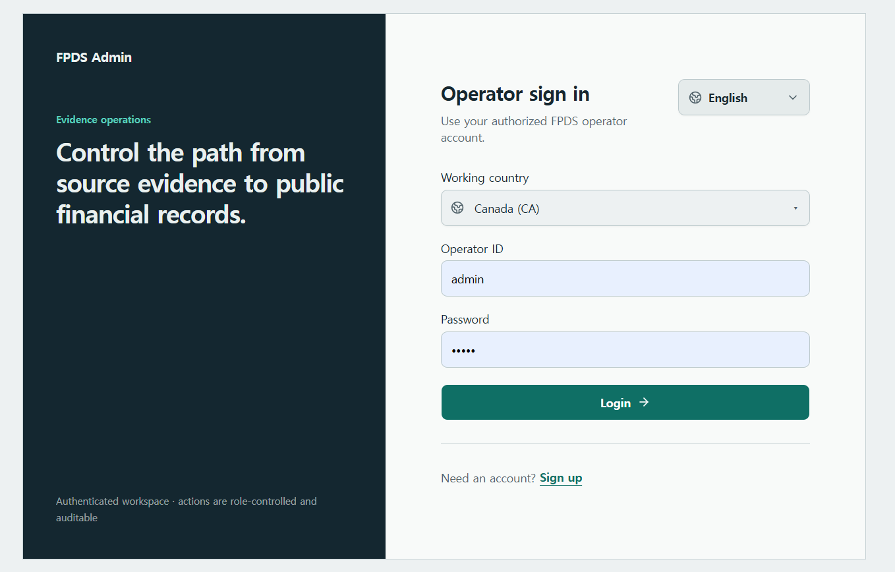

1. `Working country`에서 작업할 국가를 선택합니다.
2. 발급받은 `Operator ID`와 `Password`를 입력하고 **Login**을 누릅니다.
3. 계정이 없으면 **Sign up**으로 신청합니다. 관리자 승인 후 사용할 수 있습니다.

로그인 후에는 오른쪽 위 국가 메뉴에서 국가를 바꿀 수 있습니다. 변경을 확인하면 해당 국가의 **Overview**로 이동합니다. 은행·수집·검토 데이터는 선택한 국가를 기준으로 표시됩니다. 로그인 후에도 국가는 변경할수 있습니다.

화면 언어는 로그인 화면의 언어 메뉴 또는 로그인 후 왼쪽 아래 계정 메뉴에서 변경합니다. 현재 한국어·영어·일본어를 지원하며, 공식 원문과 직접 입력한 내용은 원래 언어로 유지됩니다. 로그아웃도 계정 메뉴에서 실행합니다.

## 2. Overview — 먼저 처리할 일 확인

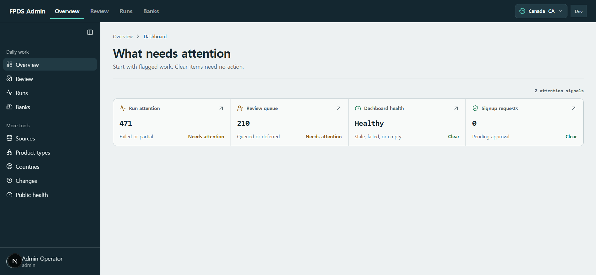

**Needs attention**으로 표시된 카드를 눌러 해당 작업으로 이동합니다.

| 카드 | 확인할 내용 |
|---|---|
| Run attention | 실패하거나 일부만 완료된 수집 실행 |
| Review queue | 검토 대기 또는 보류 중인 상품 후보 |
| Signup requests | 운영자 계정 가입 승인 요청 — 관리자용 |

`Clear`는 해당 점검 항목에 현재 조치할 일이 없다는 뜻입니다.

## 3. Banks — 은행 등록과 상품 수집

### 은행 찾기·등록하기

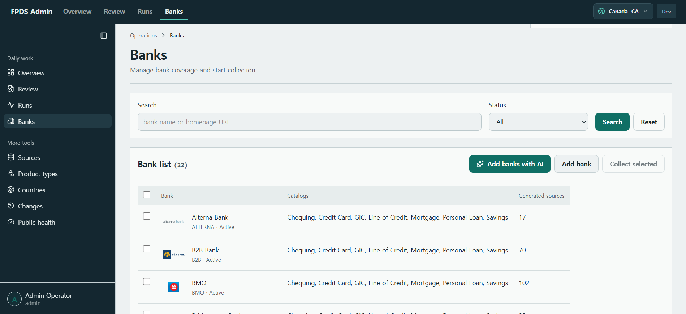

- **Search**로 은행명 또는 홈페이지 URL을 검색합니다.
- **Add bank**에서 은행명·공식 홈페이지·언어·상태를 입력하고, `Initial coverage`로 수집할 상품 유형을 선택합니다.
- 은행명을 누르면 상세 창이 열립니다. 정보를 수정한 뒤 **Save bank**로 저장합니다.

**Coverage**는 “이 은행에서 수집할 상품 유형”입니다. 예를 들어 RBC의 Chequing과 Savings는 서로 다른 수집 범위입니다.

### AI로 은행 추가하기

관리자는 **Add banks with AI → 추가할 은행 수(1~10) → Research and add banks**를 선택합니다. 결과에서 은행명·공식 홈페이지·순위 근거·Coverage를 확인합니다.

**백엔드 AI agent 역할**

- **은행 순위 조사 agent:** 선택 국가에서 아직 등록되지 않은 은행을 공신력 있는 최신 규모 순위로 찾습니다.
- **공식 근거 확인 agent:** 각 은행의 공식 명칭·홈페이지·상품 제공 페이지를 확인하고, 근거가 있는 Coverage만 구성합니다. 로고도 확인 가능한 경우 사용합니다.

중복 은행은 제외하며, 요청한 은행 수 전체를 충분한 근거로 확인하지 못하면 추가하지 않습니다. **은행 등록이 끝난 뒤 상품 수집은 별도로 실행해야 합니다.**

### 상품 수집하기

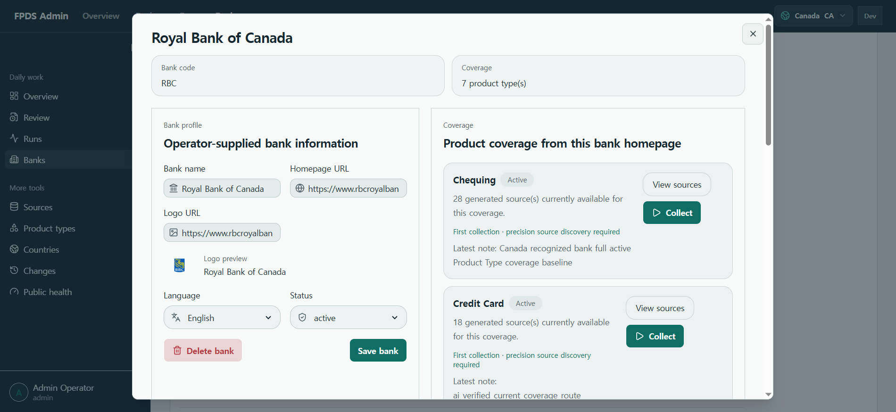

1. 은행 상세 창에서 수집할 상품 유형을 찾습니다. 필요하면 Coverage를 추가합니다.
2. 해당 유형의 **Collect**를 누릅니다. 여러 은행을 수집하려면 목록에서 체크한 뒤 **Collect selected**를 사용합니다.
3. **Runs**에서 실행 결과를 확인합니다. **View sources**는 해당 유형의 수집 소스를 보여 줍니다.

| 수집 방식 | 동작 |
|---|---|
| 최초 수집 | 상품·근거 페이지를 정밀 탐색한 뒤 수집합니다. 기존 소스가 있어도 완료 이력이 없으면 적용됩니다. |
| Normal collect | 완료 이력이 있는 항목의 현재 활성 소스를 사용합니다. |
| Detailed collect / Precision source rediscovery | 완료 이력이 있는 항목도 새 상품·변경된 근거 페이지를 다시 탐색합니다. |

**백엔드 AI agent 역할:** 수집 과정에서 공식 상품 페이지의 상품명·금리·수수료·조건을 대조하고 근거가 있는 값을 추출합니다. 상품 경로를 찾지 못한 경우에는 AI가 현재 공식 상품 경로를 조사해 보완할 수 있습니다. 문서 수집·파싱·값 정규화·형식 검증은 일반 처리 코드와 함께 수행됩니다.

수집 후에는 검증·승인 조건에 따라 자동 승인되거나 **Review**에 남습니다.

`Delete bank`는 은행과 관리용 Coverage·생성 소스를 제거하는 작업입니다. 이미 수집된 실행 데이터가 있으면 삭제가 차단됩니다.

## 4. Runs — 수집 결과와 오류 확인

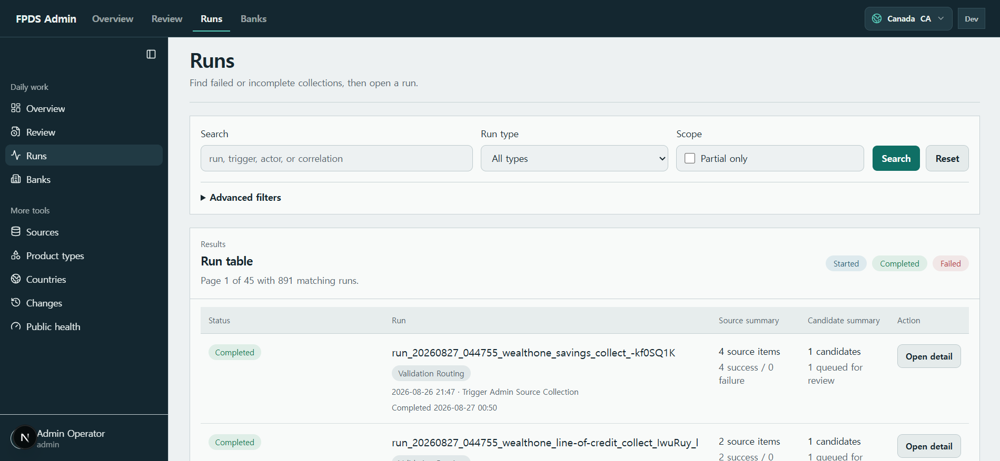

1. 실행을 검색하거나 `Partial only`로 일부 완료된 실행을 찾습니다. 상태·기간 등은 **Advanced filters**에서 좁힙니다.
2. **Open detail**을 눌러 성공·실패 소스 수, 생성 후보 수, 검토 대기 수를 확인합니다.
3. 실패 원인을 확인한 뒤 **Retry run**이 제공되면 재시도합니다. 새 재시도 실행으로 이동합니다.

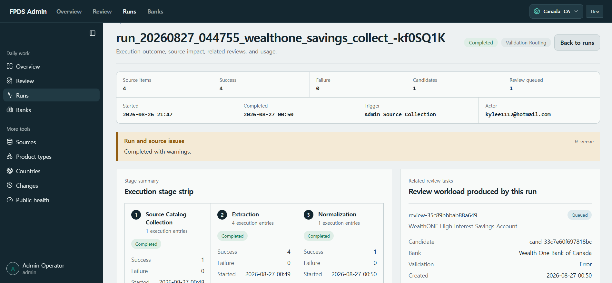

`Execution stage strip`에서 어느 단계까지 진행됐는지 보고, 연결된 검토 항목을 열어 후속 처리합니다. 추출·검증 단계의 AI 실행 정보가 있으면 해당 실행의 모델 처리 상태도 확인할 수 있습니다.

**Completed는 실행이 끝났다는 뜻입니다.** 상품이 모두 승인됐다는 뜻은 아닙니다. 캡처처럼 소스 처리는 성공해도 후보가 Review에 남을 수 있으므로 경고와 `Review queued`도 함께 확인합니다.

## 5. Review — 상품 검토와 승인

### 검토할 항목 찾기

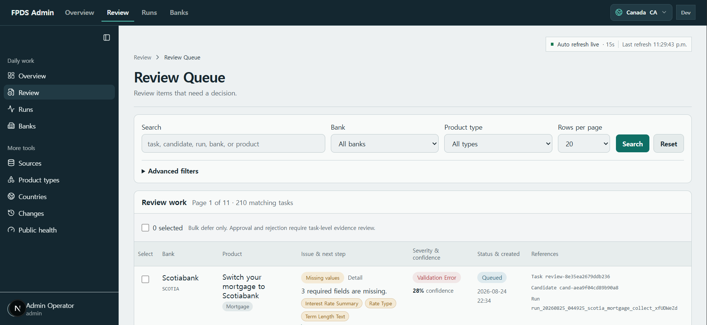

1. 은행·상품 유형·검색어로 목록을 좁힙니다.
2. `Issue & next step`에서 누락값이나 문제와 다음 조치를 확인합니다.
3. 상품명을 눌러 상세 화면을 엽니다. 목록의 여러 항목을 한꺼번에 처리하는 기능은 **보류(Defer)**용이며, 승인·거절은 개별 근거를 확인한 뒤 처리합니다.

### 공식 근거 확인 → 보정 → 결정

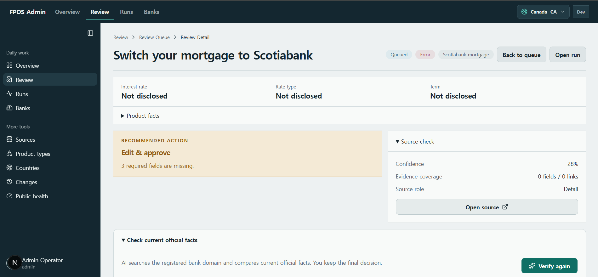

1. 상품명과 주요 값, `Recommended action`을 확인합니다.
2. **Source check → Open source**로 원문을 확인합니다. 필요하면 아래쪽 필드별 근거도 펼칩니다.
3. **Check current official facts → Verify with AI / Verify again**으로 공식 정보를 재검증합니다.
4. 문제 필드를 직접 수정하거나 **Use correction / Use all safe corrections**로 AI 보정값을 검토 입력란에 적용합니다.
5. 변경 내용과 `Diff preview`를 확인하고 아래 결정 버튼을 누릅니다. 필요하면 `Decision note`에 이유를 남깁니다.

| 결정 | 사용할 때 |
|---|---|
| Approve | 수집값을 그대로 승인할 수 있을 때 |
| Edit & approve | 근거를 확인해 값을 수정한 뒤 승인할 때 |
| Defer | 추가 확인이 필요해 나중에 처리할 때 |
| Reject | 다른 상품·부적절한 페이지 등으로 후보를 채택하지 않을 때 |

검토 결정은 `admin` 또는 `reviewer` 권한에서 가능합니다. 값 변경이 없으면 `Edit & approve`는 활성화되지 않으며, 필수값·형식·상품 검증 조건을 통과해야 승인됩니다.

**백엔드 AI agent 역할:** 등록된 은행의 공식 도메인에서 같은 국가·같은 상품의 최신 정보를 검색하고, 수집값과 필드별로 비교합니다. 결과는 **Matches(일치) / Differences(차이) / Unverified(확인 불가)**로 표시하며 공식 URL과 근거 문장을 제공합니다. 불명확한 값을 임의로 채우지 않습니다.

**이 화면에서 AI 검증이나 보정값 적용만으로 승인되지는 않습니다.** 최종 반영에는 운영자의 승인 작업이 필요합니다. `Not disclosed`나 `Unverified`를 0 또는 조건 없음으로 해석하지 마세요.

## 6. Sources — 수집 근거 확인

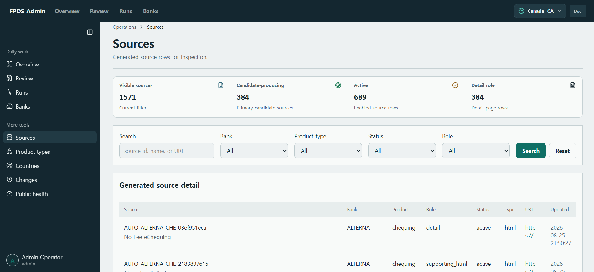

은행·상품 유형·상태·역할로 검색한 뒤 소스명을 눌러 상세 정보를 확인합니다.

- **detail:** 개별 상품 정보를 담는 페이지. 상품 후보의 주요 출처입니다.
- **supporting_html / supporting_pdf:** 금리표·수수료표·약관 등 상품 정보를 보완하는 근거입니다.
- **Candidate-producing:** 상품 후보를 만드는 용도의 소스인지 나타냅니다.

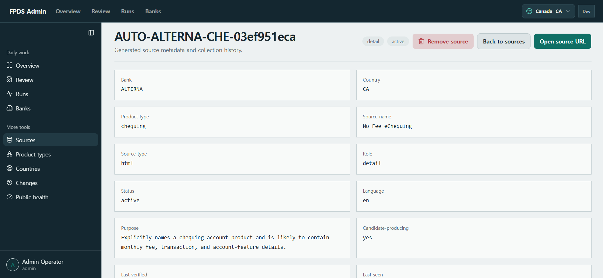

**Open source URL**로 원문을 열고, 소스 역할·상태·수집 이력을 확인합니다. AI가 추출하거나 검증한 값이 어떤 공식 자료에 기반했는지 확인할 때 사용합니다.

관리자의 **Remove source**는 소스를 `removed`로 표시하여 이후 수집 대상에서 제외합니다. 과거 실행·후보 기록은 유지됩니다.

## 7. Product Types — 수집할 상품 유형 관리

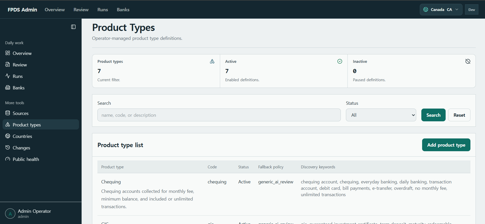

**Add product type**으로 유형을 추가하거나, 기존 유형을 눌러 코드·표시 이름·설명·상태를 수정하고 **Save product type**으로 저장합니다.

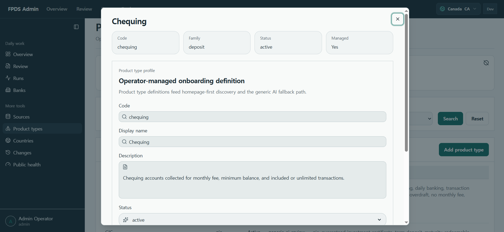

**AI와의 연결:** 상품 유형 정의와 `Discovery keywords`는 어떤 상품 페이지를 찾을지 정하는 데 사용됩니다. `generic_ai_review`는 전용 처리로 충분하지 않은 유형에 일반 AI 추출·검토 경로를 사용하는 정책입니다. 키워드와 Fallback policy는 상세 화면에서 조회합니다.

Coverage나 소스가 참조하는 유형은 삭제가 차단됩니다.

## 8. Countries — 작업 가능한 국가 관리

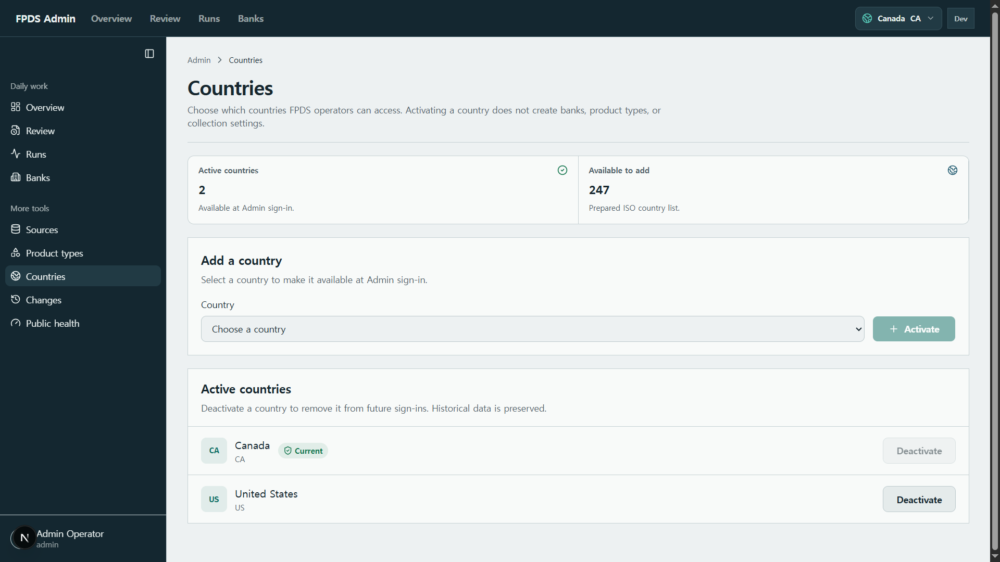

관리자만 사용할 수 있습니다.

- **국가 추가:** `Country`에서 선택하고 **Activate**를 누릅니다.
- **국가 비활성화:** 활성 국가 목록에서 **Deactivate**를 누릅니다. 과거 데이터는 유지됩니다.
- 현재 작업 중인 국가와 마지막 남은 활성 국가는 비활성화할 수 없습니다.

국가 활성화는 로그인·국가 전환 선택지를 추가하는 작업입니다. 은행·상품 유형·수집 설정을 자동으로 생성하거나 AI 수집을 시작하지 않습니다.

## 9. Changes — 변경 이력 확인

**Changes**에서 은행·상품 유형·기간 등으로 검색하여 승인된 상품의 변경 필드와 이전 값·새 값을 확인합니다. 연결된 Review와 Run으로 변경 경위를 확인할 수 있습니다.

## 10. AI 처리와 승인 흐름

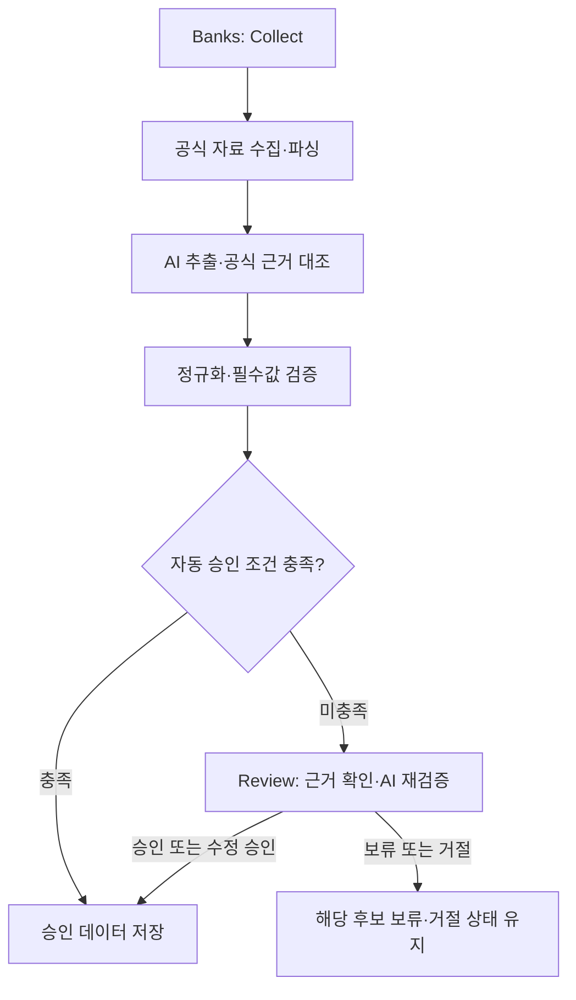

수집 후 **AI autopilot**은 대상 검토 후보를 공식 정보로 재검증하고 허용된 보정을 적용합니다. 기본 설정에서는 **상품 식별과 필수 승인 항목 100% 검증**, 미해결 차단 오류 없음 등 조건을 충족해야 자동 승인됩니다. 근거가 부족한 후보는 Review에 남습니다.

AI는 조사·추출·대조를 맡고, 승인 조건 판정과 데이터 저장은 백엔드 규칙에 따라 수행됩니다. 따라서 **Review의 수동 AI 검증**과 **수집 후 자동 승인 흐름**은 구분해서 사용합니다.