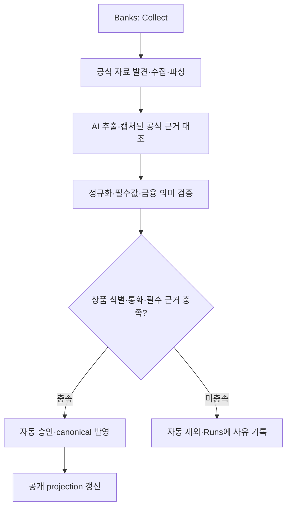

# FPDS Admin 사용자 매뉴얼

기준일: 2026-10-03 · 현행 소스와 상품수집 정책 기준

FPDS Admin은 공식 금융상품 자료를 수집하고 실행 결과와 근거를 확인하는 운영 화면입니다.
상품은 자동 검증을 통과하면 반영되고, 필수 근거가 부족하면 자동 제외됩니다.

**일상 점검:** Overview → Runs → Banks

**상품수집:** Banks → Collect → Runs에서 결과 확인

**과거 검토 기록:** More tools → Review history

이전 정책의 PDF·화면 이미지는 [과거 매뉴얼](../docs/archive/admin-manual/FPDS_Admin_사용자_매뉴얼.md)에
보존했습니다. 현재 작업 절차는 이 문서를 기준으로 합니다.

## 1. 로그인·국가·언어

1. 로그인 화면의 `Working country`에서 업무 국가를 선택합니다.
2. `Operator ID`와 `Password`를 입력하고 **Login**을 누릅니다.
3. 계정이 없으면 **Sign up**으로 신청합니다. 기존 관리자의 가입 승인 후 사용할 수 있습니다.

작업 국가를 바꾸면 확인 후 해당 국가의 Overview로 이동합니다.
국가는 서버 세션에서 관리하며 은행·수집·상품 조회 범위를 결정합니다.
현재 작업 국가와 환경 표시를 확인한 뒤 조작합니다.

한국어·영어·일본어를 지원합니다. 로그인 화면의 언어 메뉴 또는 로그인 후
왼쪽 아래 계정 메뉴에서 언어를 바꿉니다. 상품명·공식 원문·직접 입력한 내용은
원래 언어를 유지합니다. 로그아웃도 계정 메뉴에서 실행합니다.

## 2. Overview — 점검할 일 확인

수집 실행 오류, 공개 데이터 상태와 관리자용 가입 요청을 확인합니다.
주의가 필요한 항목을 눌러 Runs 또는 해당 도구로 이동합니다.
조회 실패나 미확인 값을 0건 또는 정상으로 해석하지 않습니다.

상품수집의 미충족 후보를 사람이 승인하는 작업은 없습니다.
과거 검토 기록과 운영자 가입 승인은 서로 다른 기능입니다.

## 3. Banks — 은행과 수집 범위 관리

**Search**로 은행을 찾고, 은행명을 눌러 상세 창을 엽니다.
**Add bank**에서 은행 정보와 `Initial coverage`를 지정할 수 있습니다.
**Coverage**는 은행별 상품 유형의 수집 범위입니다.

관리자의 **Add banks with AI**는 선택 국가의 은행을 조사하고 공식 홈페이지와
근거가 있는 Coverage를 등록합니다. 등록 결과와 출처를 확인합니다.
은행 등록은 상품수집이나 공개를 완료했다는 뜻이 아닙니다.

수집하려면:

1. 은행 상세에서 활성 상품 유형과 Coverage를 확인합니다.
2. 해당 유형의 **Collect**를 누릅니다. 여러 은행은 목록에서 선택한 뒤
   **Collect selected**를 사용합니다.
3. 응답의 실제 생성 Run 수와 제외 사유를 확인하고 Runs에서 결과를 봅니다.
   **View sources**로 해당 범위의 소스를 확인할 수 있습니다.

최초 수집에는 정밀 소스 탐색이 필요합니다. 완료 이력이 있는 활성 범위는
일반·상세 수집을 선택할 수 있으며 상세 수집은 소스 범위를 다시 검증합니다.
이미 진행 중인 범위를 중복 실행하지 않습니다. 비활성 범위는 복원 전 수집할 수 없습니다.
자동 예약 수집은 없습니다.

## 4. Runs — 진행·완료·실패 확인

요청된 실행은 소스 탐색 전부터 표시됩니다. Queued, Discovering sources,
Collecting, Skipped, Completed, Failed 등 상태와 은행·상품 유형을 확인합니다.

Runs는 **Auto refresh**로 15초마다 자동 갱신합니다. 필터 입력, 열린 창, 처리 중인 작업에서는 잠시 멈춥니다. **Advanced filters**는 기본 닫힘이며 **Search**로도 조회할 수 있습니다.
상세에서 단계, 소스 처리 결과, 생성 후보, 자동 제외 사유와 오류 요약을 확인합니다.

**Completed는 실행이 끝났다는 뜻입니다.** 모든 후보가 상품으로 승인되었다는 뜻은 아닙니다.
일부 소스 실패나 필수 근거 부족으로 제외된 후보가 있는지 함께 확인합니다.
누락된 선택 정보는 0 또는 조건 없음으로 채우지 않습니다.

실패·부분 완료는 원인을 확인한 뒤 허용된 범위만 재시도합니다.
재시도는 연결된 대체 Run을 만들며 원래 실패 이력을 보존합니다.
반복 장애가 있으면 원인을 해결하기 전 대량 재시도를 중지합니다.

## 5. Review history — 과거 기록 조회

**More tools** 아래에서 과거 검토 목록과 상세를 조회합니다.
상품·은행·국가, 과거 결정, 연결된 Run과 evidence를 확인할 수 있습니다.

승인, 수정 승인, 거절, 보류, 일괄 선택 및 수동 AI 재검증은 제공하지 않습니다.
새 수집은 Review 대기열을 만들지 않습니다. 근거가 부족한 상품을 수동 승인해서
자동 검증 조건을 우회할 수 없습니다.

## 6. More tools — 진단과 설정

| 도구 | 용도 |
|---|---|
| Sources | 생성된 상품 상세·보조 소스와 과거 수집 근거 확인 |
| Product Types | 상품 유형과 수집 계약 관리 |
| Countries | 작업 가능한 국가 활성·비활성 관리 — 관리자용 |
| Changes | canonical 상품의 변경 내용과 연결 이력 확인 |
| Public Health | 공개 projection 갱신 상태와 실패 진단 |

Sources의 `detail`은 상품 후보의 출처이고, `supporting_html`·`supporting_pdf`는
금리표·수수료표·약관 등 보조 근거입니다. 보조 페이지가 독립 상품을 만들지는 않습니다.
관리자의 소스 제거는 이후 수집 대상에서 제외하는 상태 변경이며 과거 기록을 보존합니다.

상품 유형을 추가해도 공개 요건을 충족했다는 뜻은 아닙니다.
`generic_ai_review`는 남아 있는 호환 정책 이름이며 수동 검토 절차를 뜻하지 않습니다.
Coverage나 소스가 참조하는 유형은 삭제가 제한됩니다.

Countries는 현재 국가와 마지막 활성 국가를 보호합니다.
국가 활성화만으로 은행·Coverage를 생성하거나 수집을 시작하지 않습니다.

## 7. 자동 처리와 근거

```mermaid
flowchart TD
    A["Banks: Collect"] --> B["공식 자료 발견·수집·파싱"]
    B --> C["AI 추출·캡처된 공식 근거 대조"]
    C --> D["정규화·필수값·금융 의미 검증"]
    D --> E{"상품 식별·통화·필수 근거 충족?"}
    E -->|충족| F["자동 승인·canonical 반영"]
    F --> G["공개 projection 갱신"]
    E -->|미충족| H["자동 제외·Runs에 사유 기록"]
```

AI의 확신도만으로 승인하지 않습니다. 정확한 공식 출처·문장·자료형·금융 의미가 필요합니다.
같은 근거로 확인된 선택 정보는 보존하고 불명확한 선택 정보는 생략합니다.
확인되지 않은 값을 0, false, 임의 통화·금리·기간으로 만들지 않습니다.

수집에 사용하는 캡처·근거·운영 기록은 비공개입니다.
Public은 승인된 공개 데이터만 읽으며 원문 evidence나 내부 진단 정보를 노출하지 않습니다.

## 8. 권한과 오류 대응

조회·쓰기 범위는 현재 세션의 역할과 국가를 따릅니다.
은행·상품 유형·수집·재시도·국가 관리와 가입 승인은 관리자 권한을 확인합니다.
`read_only`는 데이터를 변경하지 않습니다.

- **401/만료:** 다시 로그인하고 국가를 확인합니다.
- **403/CSRF 거부:** 세션과 권한을 확인합니다. 인증·보호 기능을 끄지 않습니다.
- **수집 실패:** Run ID, 단계, 오류와 영향 범위를 기록하고 필요한 재시도만 합니다.
- **로그아웃 실패:** 재시도합니다. 실패가 지속되면 세션 회수 여부를 담당자에게 확인합니다.

구체적인 장애·계정·복구 절차는 [운영 핸드북](05-operations-handbook.md)을 따릅니다.
의뢰자 환경, 계정 회수, backup/restore, UAT와 전환 승인은
[인수인계 가이드](README.md)의 별도 확인 사항입니다.

## 수집 항목 관리와 Banks 집계 (2026-10-04)

Banks의 공개 상품수는 현재 Public에서 표시 가능한 상품 기준입니다. Generated sources 옆에서 확인하고 Search로 갱신합니다.

Product Types 상세에서 현재 작업 국가의 추가 항목을 필수·선택·수집 대상 제외로 관리합니다. 공통 금융 필수 조건은 해제할 수 없습니다. 설정은 다음 수집에 적용되고, 필수 사실의 근거가 없으면 자동 제외합니다. 선택 항목이 없다는 이유로 재수집하거나 검토 작업을 만들지 않습니다. 읽기 전용 사용자는 설정을 조회합니다.
