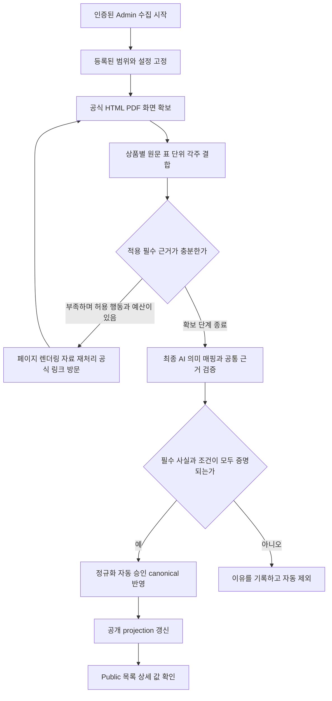

# FPDS Admin 상품 수집과 공개 개선 계획

Implementation follow-through: P1-P4 shared code/local acceptance and P5/P6
preparation are documented in the [implementation report](../00-governance/admin-collection-parity-implementation-2026-10-06.md).
Paid experiments, deployment and fresh live Public acceptance remain open.

작성일: 2026-10-06
상태: Product Owner가 요청한 원인 진단과 실행 계획. 구현과 운영 검증은 후속 단계.
기존 WBS 3.1–3.7 및 5.76의 일반 상품 수집 범위에 적용한다.

## 목표와 현재 결과

공식 근거가 충분한 상품을 FPDS Admin의 일반 수집에서 스스로 조사하고, 정확한
조건을 보존하여 자동 승인한 뒤 Public에 노출한다. 완료 기준은 실제 Admin
실행으로 생성한 상품의 Public 목록과 상세 확인이다.

National Bank의 2026-10-06 07:15:52 Vancouver 실행은 6개 Run이 완료됐지만,
17개 후보 모두 자동 제외됐고 승인과 상품 검토 대기열은 각각 0개였다.
실행 process는 `2026-10-06-native-information-proof-v2`였다.
이 사례를 단순히 이전 개선의 미배포 때문이라고 설명할 수 없다.

같은 날 직접 조사에서는 카드 4개, HISA, Redeemable Plus GIC의 추가 필수 근거를
확인했다. 이 6개는 우선 검증 대상이며, 전체 자동 승인이나 공개를 이미 입증한
상품 수는 아니다. 출처와 조건은
[National 조사 기록](../00-governance/development-journal.md#2026-10-06---national-bank-direct-evidence-feasibility-without-admin-api)에 있다.

## 확인된 근본 원인

| 문제 | 실제 확인 내용 | 필요한 변화 |
|---|---|---|
| 추가 조사 행동이 링크 방문에 치우쳐 있다 | 카드 5개·GIC 6개·Savings 1개는 모두 `no_unvisited_official_lead`로 연구를 종료했다. 해당 유형의 planner 호출은 0회였지만 다른 유형에서는 실제 호출됐다. | 새 링크가 없어도 소유 페이지를 렌더링하거나 이미 확보한 구조화 자료를 재처리한다. |
| 실제 화면의 금융 정보를 확보하지 못한다 | ECHO와 Plus에 기존 안전 브라우저를 직접 적용하면 값이 표시됐다. 자동 렌더링 감지는 두 페이지 모두 false였다. 원문에는 `${...productPricing...}` 템플릿과 공식 내장 데이터가 있었다. | 필수 필드의 증거 상태와 페이지 표현 방식으로 capture 행동을 결정한다. 은행명이나 일부 placeholder 정규식에 의존하지 않는다. |
| 원문 일치가 금융 의미를 충분히 보장하지 못한다 | `No fixed monthly fees`의 월 기본 수수료 0은 기존 함수 진단에서 거절됐다. Plus 후보에는 investment horizon의 `1 year`가 계약기간으로 남았다. 렌더링된 계약기간은 36개월이었다. | 대상 필드, 계약기간과 인출 시점의 역할, 적용 조건을 함께 검증한다. |
| 모델 입력과 승인 사실 사이에 여러 변환이 있다 | 최종 grounding은 제공된 capture만 보고 새 웹 조사를 하지 않는다. 선택 근거는 최대 24개/43,200자이며, 개별 6,400자 초과 자료는 통째로 제외한다. 정규화와 최종 gate도 별도 적용된다. | 필드의 원문·표·단위·각주를 함께 선택하고 각 단계의 보존/제외 이유를 추적한다. National의 모든 누락이 입력 제한 때문이었다고 단정하지 않는다. |
| 운영의 최종 결과까지 검증을 닫지 못했다 | 10월 5일 개선은 3개 상품의 격리된 실제 모델/서비스 replay를 입증했다. 해당 문서도 fresh authenticated Admin→Public 결과는 미검증이라고 명시했다. | 실제 Admin 시작부터 승인·projection·Public 노출까지 통과해야 운영상 완료로 처리한다. |

코드 근거는 [수집 runner](../../api/service/api_service/source_collection_runner.py),
[필수근거 연구](../../api/service/api_service/collection_evidence_research.py),
[브라우저 감지](../../worker/discovery/fpds_discovery/fetch.py),
[grounding과 근거 선택](../../worker/pipeline/fpds_extraction/service.py),
[공통 정확성 검사](../../worker/pipeline/fpds_collection_accuracy.py)다.
선행 개선 범위는
[10월 5일 일반 수집 개선](../00-governance/ordinary-collection-redesign-2026-10-05.md)에 있다.

예산 부족은 위 12개 후보의 연구 종료 사유가 아니다. 은행이 모든 정보를 미공개한다는
설명도 위 사례에 맞지 않는다. Student LOC의 담보 조건, Car loan의 자체 금리,
일부 GIC의 상충하는 조건은 여전히 필수근거 문제다. 현재 금융 필수 조건을 유지한다.

## 동일한 OpenAI를 써도 결과가 달라지는 이유

OpenAI 제공자를 공유하는 것과 모델·입력·도구·실행 제어가 동일한 것은 다르다.
FPDS의 [기본 모델 설정](../../worker/pipeline/fpds_ai_runtime.py)은 `gpt-6-luna`이며,
보존된 National 연구 planner도 그 모델을 사용했다. 실제 최종 grounding 모델과
현재 Codex의 정확한 모델이 동일하다는 비교는 수행되지 않았다. 특정 모델의
성능이 이번 실패의 원인이라고 단정하지 않는다.

| 실행 조건 | 직접 조사 | 현재 일반 수집 |
|---|---|---|
| 정보 확보 | 부족한 필드를 보고 공식 페이지·브라우저·PDF·내장 자료를 조사 | 초기 capture 뒤 관측된 공식 링크를 제한된 연구 단계에서 선택 |
| 금융 의미 확인 | 본문과 표·각주를 대조하여 계약기간과 인출 시점을 구분 | parser·추출·정규화·gate가 표현을 각각 처리 |
| 실패 후 행동 | 값의 미확보와 검증에서의 탈락을 구분해 다음 행동 선택 | 최종 grounding 이후 필수 조건이 부족하면 자동 제외 |
| 결과 확인 | 추가 근거의 존재를 설명할 수 있음 | 승인·canonical·공개 projection까지 자동 경로를 통과해야 함 |

OpenAI 도구는 요청에 구성하고 실행 결과를 모델에 전달해야 한다. 모델 호출만으로
브라우저나 조사 도구가 자동 제공되지는 않는다.
[OpenAI 도구 문서](https://developers.openai.com/api/docs/guides/tools).
Codex가 수행한 조사 행동을 FPDS의 제한된 서비스 도구로 구현한다.

## 공통 수집 경로

Admin runner·Worker CLI·직접 진단 도구가 동일한 수집·추출·검증 서비스를 호출한다.
직접 진단에만 값을 주입하거나 다른 승인 규칙을 적용하지 않는다. 평가 도구는
근거와 기대 결과를 제공하지만 canonical 수정 권한을 갖지 않는다. 기존 파이프라인을
단계별로 개선하고, 공통 서비스가 일반 Admin 실행에서 조사 행동을 수행하게 한다.

### 증거 확보 행동

필수 필드가 부족하면 원인을 먼저 분류한다. 화면이 미완성이면 같은 URL의 브라우저
capture를 사용한다. 공식 내장 자료에 값이 있으면 안전한 데이터 해석을 사용한다.
표와 각주가 떨어졌으면 같은 snapshot을 재처리한다. 필수 자료가 다른 문서에 있으면
현재 관측된 공식 링크를 방문한다. 새 링크 부재를 은행의 미공개 판정으로 쓰지 않는다.

planner 출력은 서버가 제시한 행동 ID와 이유로 제한한다. 행동은
`render_owned_page`, `reparse_owned_record`, `capture_observed_official_link`, `stop`이다.
임의 URL·금리·상품명·공식 도메인을 planner가 만들어 승인할 수 없다. 행동 결과는
기존 snapshot/parse 저장 경로와 해당 Run의 근거 참조에 반영한다.

브라우저와 정적 데이터 해석은 표현 방식별 공통 기능으로 구현한다. National의
은행 코드나 상품명으로 승인 예외를 만들지 않는다. JavaScript 문자열의 공식 JSON을
해석할 때 코드 실행을 사용하지 않는다. 일반적인 product ID나 다른 상품의 자료를
해당 상품의 근거로 쓰지 않으며, 소유 DOM·실제 템플릿 참조·제품 식별·단위·조건을
묶어서 검증한다. 브라우저는 기존 sandbox와 안전한 네트워크 통제를 적용한다.
공식 도메인·redirect·SSRF 검사는 모든 fetch에 유지한다.

### 금융 의미와 근거 보존

공통 내부 증거 표현에 상품 소유권, native 필드 역할, 값과 단위, 계약기간,
적용 조건, 표의 행과 열, 연결된 각주, 정확한 원문 범위, URL·언어,
snapshot·parse ID·raw SHA-256을 보존한다. 공개 필드를 늘리는 계약은 아니다.
필수근거 진단부터 extraction·normalization·promotion까지 같은 표현을 읽는다.

AI는 제한된 schema로 필드 역할과 원문 범위를 제안할 수 있다. 서버는 원문의 실제
존재, 상품 일치, 타입·단위·숫자·부정 의미·조건·충돌을 검증한다. AI의 match나
confidence는 승인 근거가 아니다. 새 표현을 허용할 때는 출처가 있는 성공·실패
회귀 사례를 먼저 추가하고 공통 검증기·추출·정규화 지침을 함께 수정한다.
자유로운 자연어 모델 판단을 정답으로 취급하지 않으며, 판별할 수 없는 필수 의미는
자동 제외한다.

미해결 필수 조건의 identity·본문·표·법적 조건을 우선 선택한다. 전체 표가 입력
예산을 초과하면 관련성이 증명된 완전한 행과 그 행의 모든 조건을 선택한다.
조건을 잘라 숫자만 남기지 않는다. 여전히 예산을 초과하면 그 원인을 기록한다.

증명된 값과 근거 참조는 정규화에서 보존한다. 모델이 그 의미를 다시 작성하지
않도록 하고, 손실·변경·충돌은 승인 전에 검사한다. 동일 source/hash라도 이전
parser·prompt·모델·policy로 만든 실패를 새 설정의 결과처럼 재사용하지 않도록
cache key와 process lineage를 확인한다.

Plus의 계약기간 36개월, 첫 인출 가능 시점인 가입 기념일, investment horizon 1년은
다른 역할이다. 36개월을 임의의 일수로 바꾸지 않는다. HISA의 월 기본 수수료 0도
거래 수수료나 종이 명세서 비용까지 없다는 뜻으로 확대하지 않는다.

### 예산과 종료

현재 승인된 [공통 제한](../../worker/pipeline/fpds_collection_process.py)을 유지한다.
연구 최대 2회, 추가 공식 URL detail당 2개/Run당 48개, planner Run당 8회다.
최종 grounding은 detail당 1회이며 기존 정규화 호출은 별도로 계측한다.
선택 정보만 부족할 때 추가 조사나 호출을 하지 않는다.

동일 URL 렌더링은 기존 fallback 수행 여부를 포함하여 detail당 최대 1회,
Run당 최대 48회로 제한하는 방안을 제안한다. 기존 URL 방문 제한과 별도로
명시·검증할 새 행동 제한이며, 구현 단계에서 시간·환경을 확인해야 한다.
정적 재처리는 동일 snapshot/표현 버전당 1회로 제한한다. 기존 timeout과 fetch 크기
제한을 적용하고 실패를 자동 재시도로 반복하지 않는다. 높은 모델 호출/수집 예산이
이번 계획으로 승인됐다고 해석하지 않는다.

종료 이유는 `official_fact_not_found_in_bounded_sources`, `source_conflict`,
`unsupported_representation`, `evidence_not_selected`, `field_meaning_unproven`,
`normalization_fact_loss`, `capture_unavailable`, `budget_exhausted`로 구별한다.
첫 상태도 은행 전체의 미공개라는 결론은 아니다. 마지막 자동 승인은 기존 금융
필수 조건과 근거 digest 검사를 그대로 적용한다.

## 실행 순서와 단계별 완료 기준

| 순서 | 작업과 주요 경계 | 완료 기준 |
|---|---|---|
| P1 재현과 기준 데이터 | National 17개 snapshot/후보와 renderer·gate 진단을 회귀 데이터로 정리하고, capture부터 제외까지 필드별 상태를 연결한다. | 과거 17개 제외를 재현한다. 미확보·미선택·의미 거절·조건 충돌을 구별하고 목표 6개의 전체 근거와 기대 필드를 독립적으로 고정한다. |
| P2 표현과 조사 행동 | `fetch.py`·parser·native record 처리·`collection_evidence_research.py`에 공통 렌더링/재처리 행동을 연결한다. | ECHO·Plus의 실제 값이 일반 서비스에서 확보된다. 새 링크 없이도 올바른 행동을 선택하고 hash·Run ownership·한도·실패 종료를 검증한다. 다른 사이트의 동적 표현도 테스트한다. |
| P3 금융 의미와 보존 | shared accuracy/field contract·extraction·normalization을 함께 수정한다. | 월 기본 수수료 부정 표현과 정확한 기간/인출 경계를 검증한다. 선택 근거부터 승인 receipt까지 값·단위·조건·원문 참조를 보존하고 waiver·이웃 상품·조건부 금리 오승인을 막는다. |
| P4 일반 서비스 통합 | 실제 저장 artifact loader·origin repository·validation·promotion·aggregate refresh를 연결하고 직접 진단도 이 경로를 사용한다. | 목표 6개가 전체 필수 조건을 충족할 때만 자동 승인된다. 누락 origin·충돌·화면 장애는 자동 제외된다. 상품 Review task는 0개이며 승인과 공개 반영 상태를 구별한다. |
| P5 실제 모델 평가 | 기존 configured model로 동일 capture·설정의 격리 평가를 수행하고 모델 차이는 통제 비교로 분리한다. | National과 여러 은행의 성공/실패 사례에서 사실·조건이 기대 근거와 일치한다. 잘못된 승인 0개, 충분한 필수 근거가 있는 기준 사례의 누락 0개를 해당 고정 평가셋에서 충족한다. |
| P6 배포와 일반 Admin 확인 | API·runner·Worker·필요 dependency를 같은 release로 준비하여 승인된 환경에 적용하고 인증된 Admin 실행과 공개 갱신을 확인한다. | 실제 Run의 build/process/parser/prompt/model/profile/settings를 확인한다. canonical과 최신 Public snapshot의 값·통화·기간·조건이 일치하며 실제 목록·상세까지 확인해야 운영상 완료다. |

P1→P2→P3→P4의 재현과 회귀 검증을 먼저 마친다. 유료 모델 호출이 필요한 P5와
외부 상태를 바꾸는 P6는 비용·대상·환경이 정해진 실행 슬라이스로 다룬다.
이번 작업은 계획 수립이며 런타임 구현·유료 실행·데이터 변경·배포를 수행하지 않는다.

문제가 생기면 저장된 실패 근거로 돌아가 수정한다. 같은 입력의 유료 수집을
반복하여 성공 여부만 관찰하지 않는다. 공개 확인에 실패하면 승인 단계와 projection
단계 중 어느 지점이 실패했는지 별도로 남긴다.

## 우선 검증 상품과 보호해야 할 조건

아래 숫자는 2026-10-06 근거의 회귀 기준이다. 새 실행의 공개 값은 그 실행에서
확보한 현행 공식 근거를 따른다. 과거 숫자를 채워 Public을 복구하지 않는다.

| 기준 상품 | 확인된 추가 근거 | 전체 통과에서 확인할 조건 |
|---|---|---|
| ECHO Cashback Mastercard | 연회비 CAD 30, 일반 구매 연이율 20.99% | 정보표의 연간 단위·주카드 fee·일반 구매 조건을 보존한다. |
| Platinum Mastercard | 연회비 CAD 70, 일반 구매 연이율 20.99% | 첫해 환급 조건을 기본 연회비 0으로 바꾸지 않는다. |
| World Mastercard | 연회비 CAD 115, 일반 구매 연이율 20.99% | 오래된 2022년 promotion 문구를 현재 조건으로 쓰지 않는다. |
| World Elite Mastercard | 연회비 CAD 150, 일반 구매 연이율 20.99% | 추가 카드·우대 대상·연체 금리와 구별한다. |
| High Interest Savings Account | 기본 월 수수료 0, 전 잔액의 연이율 0.55% | 일별 잔액 계산/월별 지급과 별도 거래 비용을 보존한다. |
| Redeemable Plus GIC | 계약기간 36개월, 연이율 0.30%, simple/compound 선택 | 가입 기념일의 전액/일부 인출과 그때의 무벌금 조건을 증명한다. |

우선 공식 출처는
[카드 정보표](https://www.nbc.ca/content/dam/bnc/particuliers/pdf/tarification-carte/ppo_form_summary_terms_conditions_credit_card.pdf),
[HISA](https://www.nbc.ca/personal/savings-investments/accounts/high-interest.html),
[Plus GIC](https://www.nbc.ca/personal/savings-investments/gic/redeemable-plus.html)다.
원문 snapshot과 진단 결과는 비공개 ignored 경로
`tmp/national-direct-assessment-20261006/`에 보존돼 있다.

negative 사례에는 담보 근거가 없는 Student LOC, 다른 상품의 금리를 가져온 Car loan,
Syncro의 prime+spread/floor를 무조건 scalar로 바꾼 결과, 모기지 family를 개별 상품으로
승인한 결과, Plus의 1년 horizon을 계약기간으로 쓴 결과를 포함한다. GIC에서는
3개월과 90일, 1개월과 30일을 임의로 동치 처리하지 않는다. USD/CAD 충돌,
14개월/12·24개월 variant 불일치, non-redeemable/access 충돌도 해결 없이 통과시키지
않는다. 실제 출처로 모순이 해소되거나 variant 경계가 증명되면 새 회귀 기준을 추가한다.

다른 은행의 평가에는 CIBC·Coast Capital·Haventree·Laurentian·Manulife의 기존 출처가
있는 사례와 수정에 사용하지 않은 표현/상품을 포함한다. 구현과 같은 정규식으로
정답을 생성하지 않는다. 공식 원문과 독립적인 기대 값으로 검증한다. 이는 개발
평가이며 실행 중 사람의 상품 승인 단계가 아니다.

## 모델 영향과 실제 공개 평가

같은 configured model로 현재 경로와 개선 경로를 비교하여 시스템 개선 효과를
측정한다. 이후 동일한 보존 capture·선택 chunk·field policy·schema·reasoning·cache
설정에서 모델만 바꿔 미해결 오류의 영향을 측정한다. 지원하는 설정이 다르면 그
차이를 명시하고 동일 조건 비교라고 부르지 않는다. 비용이 큰 모델을 기본값으로
바꾸는 결정은 결과와 예산을 보고 내린다.

유료 비교안은 대표 3개(ECHO·HISA·Plus), 모델 최대 2개, 동일 입력 3회 반복으로
최종 grounding 최대 18회다. 기존 결과를 먼저 재사용하고 불필요한 호출은 생략한다.
이는 후속 실험 상한 제안이며 지금 실행하지 않는다. 실제 모델 ID, reasoning,
prompt/schema hash·선택 근거 hash를 기록하고 최소/중앙 결과를 함께 제시한다.
변동성 평가용 반복은 FPDS 모델 결과 cache를 우회하고 실제 provider 호출 receipt로
독립 시행을 확인한다. capture는 같은 hash의 자료를 재사용한다. 단일 성공을 전체
안정성으로 확대하지 않는다. 실험 중 설정을 바꾸면 별도 variant로
기록하고 실패 결과를 보존한다.

잘못된 승인과 사실 오류를 먼저 막고, 근거가 충분한 평가 상품의 통과율을 유형과
표현 방식별로 본다. 조사 호출·렌더링 횟수·시간은 제한된 private Run receipt와
평가 artifact에만 기록한다. 기존 보존 정책을 따르고 일반 LLM 비용 ledger나
Admin Usage 화면을 재도입하지 않는다.
[OpenAI 평가 지침](https://developers.openai.com/api/docs/guides/evaluation-best-practices).

실제 Admin 검증은 기존 UI가 지원하는 National 카드·Savings·GIC 최소 선택 범위에서
시작한다. 임의로 준비한 6개 값만 넣지 않으며, 등록된 모든 대상과 settings를 고정하고
결과를 모두 분류한다. 목표 6개는 해당 실행의 필수 근거가 유효하고 충분할 때 자동
승인과 Public 노출을 확인한다. 나머지도 근거에 따라 승인/제외한다. 이후 다른
은행의 대표 범위로 넓힌다.

1. 실제 인증된 Admin 시작과 Run/source/settings/budget receipt를 확인한다.
2. 필드별 capture→선택 근거→추출→정규화→자동 검증 값을 대조한다.
3. 승인 후보의 current canonical version과 promotion 기록을 확인한다.
4. aggregate refresh의 요청·성공 상태와 현재 country snapshot을 확인한다.
5. Public API 목록/상세와 실제 화면의 금리·수수료·통화·기간·조건을 확인한다.
6. 불완전·충돌 후보의 비노출, 상품 Review task 0개, 비공개 원문 비노출을 확인한다.

Run `completed`는 단계 처리가 끝났다는 뜻으로 유지한다. 결과에서는 수집 대상·
근거 충족·자동 승인·제외·공개 반영 수와 종료 이유를 구별한다. 올바르게 모두
제외한 Run을 처리 실패로 바꾸지 않으며, 처리 완료를 공개 성공으로 표현하지 않는다.
공개 갱신이 지연/실패하면 승인과 공개 반영 상태를 구별하여 기존 운영 경로에서 확인한다.

## 범위와 남은 위험

현재 [정확성 정책](../03-design/collection-accuracy-policy.md),
[필드 계약](../03-design/financial-product-field-contract.md),
[지원 범위](../02-requirements/scope-baseline.md)를 유지한다. 선택 정보 부족은
조사·재시도·순위 감점으로 이어지지 않으며 동일 근거에서 증명된 선택 정보는 보존한다.
통화 기본값은 기존 CA/CAD·US/USD 규칙만 사용한다. Checking 거래 비용,
GIC/CD 인출 접근과 결과, LOC 담보 조건은 조건부 필수이며 모델 신뢰도로 대체하지 않는다.

공식 사이트 변경·자료 불일치·브라우저 실행 불가·연구 한도·모델 변동은 실패 원인이
될 수 있다. 부족한 상품은 자동 제외하고 구체적인 실패 유형을 남긴다. 모든 은행의
모든 상품 승인을 보장하지 않는다. National과 은행 간 평가를 통과한 뒤 실제
일반 실행의 공개 결과로 효과를 확인한다.

새 국가/상품 유형·외부 공개 원문·인간 상품 Review·영구 복구 메뉴/스케줄러·
BX-PF write-back은 포함하지 않는다. 배포·새 수집·canonical/Public 변경은 후속
실행 범위로 다룬다. 다음 작업은 P1 재현 데이터와 필드별 손실 추적, 그리고
P2 공통 표현 확보를 실제 실패에서 검증하는 것이다.
