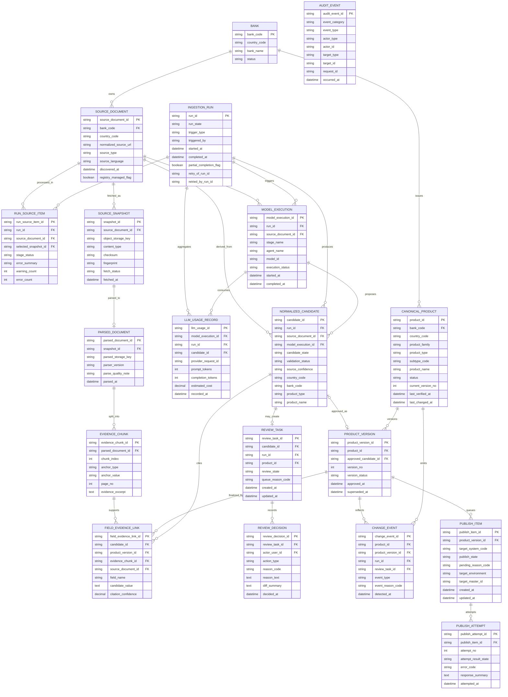

# FPDS ERD Draft

Version: 1.0  
Date: 2026-04-01  
Status: Approved Baseline for WBS 1.4.2  
Source Documents:
- `docs/02-requirements/FPDS_Requirements_Definition_v1_5.md`
- `docs/01-planning/plan.md`
- `docs/01-planning/WBS.md`
- `docs/03-design/domain-model-canonical-schema.md`
- `docs/03-design/workflow-state-ingestion-design.md`
- `docs/03-design/review-run-publish-audit-state-design.md`
- `docs/03-design/system-context-diagram.md`
- `docs/00-governance/decision-log.md`

---

## 1. Purpose

이 문서는 `WBS 1.4.2 ERD 초안 작성`을 닫기 위한 기준 문서다.

목적:
- FPDS의 핵심 운영 데이터 모델을 관계형 관점에서 한 장으로 고정한다.
- evidence, chunk, candidate, product, review, run, publish, usage 중심 저장 구조를 명확히 한다.
- `1.4.3 snapshot/evidence 저장 전략`, `1.4.4 retrieval/vector`, `1.5.x API`, `1.6.x security`가 같은 데이터 경계를 참조하도록 맞춘다.

이 문서는 논리 ERD 초안이다.  
exact column type, index, partitioning, retention policy, auth/session schema, BX-PF payload schema, vector backend physical schema는 후속 WBS에서 구체화한다.

---

## 2. Baseline Decisions Carried Forward

본 문서는 아래 확정사항을 반영한다.

1. FPDS는 source snapshot, parsed text, evidence, run, review, usage, audit, publish metadata를 소유한다.
2. review queue 생성 단위는 `candidate`다.
3. run은 top-level execution record이며 source/stage 단위 retry와 partial completion을 허용한다.
4. publish lifecycle은 review/run과 분리된 독립 추적 단위를 가져야 한다.
5. approved normalized product master의 target store는 BX-PF다.
6. canonical product는 versioning 또는 equivalent history strategy를 가져야 한다.
7. source-derived field는 source language 단일 값으로 유지하고, UI 번역 리소스는 별도 저장 경계로 분리한다.

---

## 3. Naming Harmonization for This ERD

문서 간 용어가 완전히 같지 않기 때문에, 이번 ERD 초안에서는 아래 이름을 기준으로 통일한다.

| Existing Wording in Docs | Adopted ERD Entity | Reason |
|---|---|---|
| `crawl_run`, `run` | `ingestion_run` | crawl만이 아니라 discovery부터 aggregate refresh까지 포함하는 top-level run이기 때문이다. |
| `extraction_run`, `model run reference` | `model_execution` | extraction 외 normalization/validation 보조 호출까지 수용할 수 있는 중립 명칭이 필요하다. |
| `publish_event` | `publish_attempt` | event/history row와 현재 상태 tracker를 분리해야 publish lifecycle을 안정적으로 표현할 수 있다. |
| `publish_item or equivalent publish-tracking record` | `publish_item` | state machine 문서가 요구하는 현재 상태 추적 엔터티다. |
| `review_status` on candidate | `candidate_state` + `review_task.state` | candidate lifecycle과 human review state를 분리하기 위해서다. |
| `canonical_product` + `product_version` | 둘 다 유지 | continuity identity와 immutable approved snapshot을 동시에 보존해야 change/publish/idempotency가 단순해진다. |
| logical `field_evidence_link` | `field_evidence_link` | candidate/product version 모두 연결 가능한 공통 trace table로 유지한다. |

위 naming은 이번 ERD의 논리 기준이다.  
구현 시 테이블명 접두사나 snake_case 세부 명칭은 바뀔 수 있지만, 엔터티 책임 분리는 유지해야 한다.

---

## 4. Core ERD

---

## 5. Entity Notes

### 5.1 Ingestion and Evidence Layer

#### `bank`

- canonical bank reference 엔터티다.
- `source_document`, `canonical_product`가 공통으로 참조한다.
- exact bank profile 확장 필드는 현재 ERD 범위 밖이다.

#### `source_document`

- source identity의 안정 키를 보유한다.
- 추천 natural key는 `bank_code + normalized_source_url + source_type`다.
- registry seed 여부와 discovered metadata를 함께 가진다.

#### `run_source_item`

- 같은 source가 여러 run에 반복 등장하므로 `run`과 `source_document`의 연결 엔터티가 필요하다.
- source 단위 실패/경고/선택 snapshot 추적은 이 테이블에 둔다.
- run summary와 source drilldown을 함께 만족시키는 핵심 엔터티다.

#### `source_snapshot`

- raw HTML/PDF object와 fetch metadata를 보관한다.
- 동일 source에서 fingerprint가 같으면 재사용 가능한 단위다.
- exact object storage naming convention은 `1.4.3`에서 닫는다.

#### `parsed_document`

- snapshot에서 파생된 parsed text 저장 단위다.
- parser version과 parse quality note를 함께 보관한다.
- parsed text 원문 전체는 object storage key 또는 equivalent ref로 보관하는 것을 기본으로 본다.

#### `evidence_chunk`

- retrieval-ready evidence 단위다.
- page/section anchor, excerpt, chunk index를 통해 trace viewer와 retrieval을 동시에 지원한다.
- vector embedding 또는 ANN index용 물리 스키마는 이 테이블에 포함하지 않고 `1.4.4`에서 닫는다.

### 5.2 Candidate, Review, Canonical Layer

#### `normalized_candidate`

- extraction + normalization 결과의 검토 대상 초안이다.
- `candidate_state`는 candidate lifecycle을 의미한다.
- human review workflow 상태는 `review_task.review_state`에서 별도로 관리한다.

권장 `candidate_state` 예시:
- `draft`
- `auto_validated`
- `in_review`
- `approved`
- `rejected`
- `superseded`

#### `field_evidence_link`

- logical `field_evidence_link`를 관계형으로 표현한 공통 trace table이다.
- candidate trace와 finalized product version trace를 모두 담기 위해 `candidate_id`, `product_version_id`를 optional FK로 둔다.
- 한 row는 둘 중 하나만 채우는 것을 기본 규칙으로 본다.

#### `review_task`

- candidate당 최대 1개의 active task를 가진다.
- current state와 queue metadata를 저장하는 운영 엔터티다.
- opening/assignment/lock 같은 뷰어 메타데이터는 persisted state와 분리한다.

#### `review_decision`

- approve/reject/edit/defer/requeue의 append-only action history다.
- override diff preview와 reason 기록 요구사항을 만족시키기 위해 별도 테이블로 둔다.
- `review_task`는 current state, `review_decision`은 history라는 분리가 핵심이다.

#### `canonical_product`

- continuity identity를 대표하는 canonical master다.
- 은행/국가/상품 분류/현재 상태/현재 버전 포인터 성격의 필드를 가진다.
- BX-PF가 target master여도 FPDS 내부 continuity identity는 유지한다.

#### `product_version`

- 승인 시점의 immutable approved snapshot이다.
- `canonical_product`의 history 전략을 단순하게 만들기 위해 독립 엔터티로 둔다.
- publish, change_event, finalized evidence link는 version 단위를 기준으로 연결하는 것을 기본으로 본다.

#### `change_event`

- `New`, `Updated`, `Discontinued`, `Reclassified`, `ManualOverride`를 표현한다.
- product continuity와 version snapshot, run/review context를 함께 추적한다.
- 동일 재실행으로 의미 변화가 없으면 중복 event를 만들지 않는 idempotency 기준을 따른다.

### 5.3 Publish, Usage, Audit Layer

#### `model_execution`

- PRD의 `extraction_run`, workflow의 `model run reference`를 수용하는 중립 엔터티다.
- extraction/normalization/validation 보조 호출의 실행 단위를 기록한다.
- full prompt/response 저장 여부는 보안/비용 정책과 함께 후속 결정으로 남긴다.

#### `llm_usage_record`

- token/cost tracking의 최소 저장 단위다.
- `run`, `model_execution`, `candidate`와 연결 가능해야 anomaly drilldown 요구사항을 만족한다.
- run-level aggregation은 이 테이블을 기반으로 계산한다.

#### `publish_item`

- publish lifecycle의 current-state tracker다.
- `pending`, `published`, `retry`, `reconciliation` 상태와 target linkage를 가진다.
- canonical approval을 롤백하지 않는 별도 publish boundary를 표현한다.

#### `publish_attempt`

- PRD/workflow에서 말하는 `publish_event` history row를 이 테이블로 해석한다.
- attempt number, retryable failure, ambiguous response, reconciliation 진입 기록을 보관한다.
- `publish_item` current state와 append-only attempt history를 분리한다.

#### `audit_event`

- review/run/publish/auth/config/usage event를 공통 포맷으로 저장한다.
- target이 polymorphic이므로 현재 ERD에서는 `target_type + target_id`를 기본으로 둔다.
- exact optional FK 전략은 구현 시점에 결정할 수 있지만, append-only와 correlation metadata 요구는 유지한다.

---

## 6. Supporting Entities Outside the Core Diagram

아래 엔터티는 필요하지만, 핵심 운영 흐름을 읽기 쉽게 하기 위해 core ERD에서 분리했다.

| Entity | Why It Exists | Recommended Direction |
|---|---|---|
| `taxonomy_registry` | `product_type`, `subtype_code`를 관리형 code registry로 운영하기 위해 | single registry table 또는 hierarchy-friendly code table |
| `translation_resource` | EN/KO/JA UI label, status label, badge label, methodology text를 분리 저장하기 위해 | `resource_key + locale` unique 구조 권장 |
| `processing_policy_config` | confidence threshold, force-review issue code, discontinued absence threshold를 외부 설정으로 운영하기 위해 | versioned config or append-only config change history 권장 |
| `dashboard_metric_snapshot` | KPI snapshot/freshness 기록용 | aggregate refresh 결과 저장 단위 |
| `dashboard_ranking_snapshot` | ranking widget 결과 저장용 | filter scope, product type, metric key 포함 권장 |
| `user_account` | reviewer/operator actor reference용 | auth provider 종속 세부 schema는 `1.6.x`에서 닫기 |

이 중 `translation_resource`, `dashboard_metric_snapshot`, `dashboard_ranking_snapshot`는 PRD에 직접 명시된 저장 단위다.  
scatter/grid cache 분리는 `docs/03-design/aggregate-cache-refresh-strategy.md`, `docs/03-design/insight-dashboard-metric-definition.md`, `docs/03-design/product-type-visualization-principles.md`에서 구체화한다.

---

## 7. Follow-On Items Around This ERD

아래 항목은 ERD 이후 상세화가 필요한 연결 문서다.

| Area | Open Item | Follow-Up WBS | Why It Does Not Block 1.4.2 |
|---|---|---|---|
| Evidence Storage | object key naming, raw/parsed retention, metadata normalization | `docs/03-design/source-snapshot-evidence-storage-strategy.md` | ERD 이후 storage artifact와 metadata 경계를 상세화한 문서다. |
| Retrieval | vector index scope, pgvector starting point, fallback rule | `docs/03-design/retrieval-vector-starting-point.md` | evidence chunk retrieval starting point를 상세화한 문서다. |
| Aggregate Cache | product grid projection, snapshot domains, refresh/TTL | `docs/03-design/aggregate-cache-refresh-strategy.md` | aggregate refresh mechanics를 상세화한 문서다. |
| BX-PF | exact write payload, field mapping, response schema | `docs/03-design/api-interface-contracts.md` Section 7 | publish adapter contract를 상세화한 문서다. |
| Auth/RBAC | session/token schema, role matrix, auth session tables | `1.6.1`, `1.6.2` | actor reference만 유지하면 core operational ERD는 성립한다. |
| Environment Separation | env topology, private worker boundary, data plane isolation | `docs/03-design/environment-separation-strategy.md` | environment/trust boundary를 상세화한 문서다. |
| Security | audit retention duration, secret/credential detail, SSRF allowlist tables | `1.6.5` ~ `1.6.7` | security metadata exact schema는 후속 정책화가 가능하다. |

---

## 8. Interfaces and Follow-On Work Unlocked

이 문서는 아래 후속 작업의 기준 입력이다.

- `1.4.3`: snapshot, parsed text, chunk metadata 저장 전략 상세화
- `1.4.4`: retrieval/vector backend 시작점 및 embedding schema 설계
- `1.4.5`: aggregate/grid/ranking/scatter refresh 전략 설계
- `1.5.1`: public products/dashboard API 응답 source 설계
- `1.5.2`: admin review/run/publish/usage API 응답 source 설계
- `1.5.3`: internal orchestration interface의 입출력 shape 정리
- `1.5.4`: BX-PF write contract와 publish response mapping 정리
- `1.5.5`: external API resource draft 정리
- `1.6.x`: auth actor, audit, privilege change, session/security metadata 설계

---

## 9. WBS Mapping

| WBS ID | Closure in This Document |
|---|---|
| 1.4.2 | Sections 2-8 |

---

## 10. Change History

| Date | Change |
|---|---|
| 2026-04-01 | Initial ERD draft baseline created for WBS 1.4.2 |
