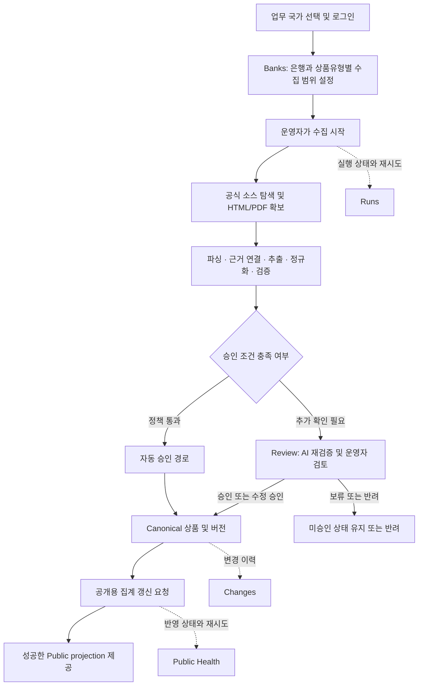

# FPDS Admin 목적과 전체 기능

- 기준일: 2026-09-12
- 기준: 현재 저장소의 페이지, API, 서비스·worker 구현과 활성 요구사항 대조
- 대상: 제품 책임자, 운영자, 검토자, 개발·인수인계 담당자

이 문서는 현재 구현을 설명한다. 기능이 코드에 있다는 사실과 특정 환경에
배포되어 실제 사용할 수 있다는 사실은 구분한다. 이번 작성에서는 운영 DB,
배포 환경, 실제 수집·승인 결과를 새로 조회하거나 변경하지 않았다.

## 1. Admin의 목적

FPDS(Finance Product Data Service)는 은행 공식 웹페이지와 PDF에 흩어진
금융상품 정보를 수집하고, 근거를 연결해 정규화·검증한 뒤 비교에 사용할 수 있는
데이터로 만드는 서비스다. **FPDS Admin은 이 데이터의 수집 범위, 품질 문제,
승인과 변경 이력, 공개 데이터 반영 상태를 운영하는 내부 업무 도구**다.

운영자가 답해야 하는 질문은 다음과 같다.

- 어느 국가의 어떤 은행·상품유형을 수집할 것인가?
- 수집이 어디까지 진행됐고, 실패·부분 완료의 원인은 무엇인가?
- 수집된 금리·수수료·기간·조건이 해당 상품의 공식 근거와 일치하는가?
- 어떤 후보를 승인하고, 무엇을 수정·반려·보류해야 하는가?
- 승인된 데이터가 공개용 집계에 반영됐는가? 이전 값과 무엇이 달라졌는가?

Admin의 핵심 결과물은 근거가 연결된 승인 상품과 추적 가능한 업무 이력이다.
은행 거래, 계좌 개설, 개인 자산 관리, 소비자별 적합성 심사는 Admin의 기능이 아니다.

근거: [요구사항](../02-requirements/FPDS_Requirements_Definition_v1_5.md),
[Admin README](../../app/admin/README.md),
[API 구현](../../api/service/api_service/main.py).

## 2. 전체 업무 흐름과 용어

| 용어 | 업무상 의미 |
|---|---|
| Bank | 국가와 공식 홈페이지 등 수집 주체를 정의하는 금융기관 프로필 |
| Product Type | Chequing, Savings, GIC 등 수집·검증에 쓰는 상품유형 정의 |
| Coverage / Source Catalog | 특정 은행에서 특정 상품유형을 수집할지와 공식 진입 경로를 정하는 설정 |
| Source | 탐색으로 확보한 개별 공식 페이지·PDF. 상품 상세와 보조 근거의 역할이 구분됨 |
| Run | 수집 작업 한 번의 실행 기록. 여러 은행·유형을 선택하면 여러 Run이 생성될 수 있음 |
| Candidate | 추출·정규화한 상품 후보. 생성됐다는 사실만으로 승인·공개되지 않음 |
| Evidence / Trace | 값의 출처 URL, 수집 시각, 원문 발췌, 필드 연결 정보 |
| Review Task | 후보의 누락·충돌·품질 문제를 확인하고 결정하는 검토 단위 |
| Canonical Product / Version | 승인된 상품과 그 값의 버전 |
| Public Projection | 공개 허용 필드만 담은 집계 결과. Public은 최근 성공한 결과를 읽음 |

**수집 완료, 승인 완료, 공개 반영 완료는 서로 다른 상태다.** Run이 완료돼도
검토 대상이 남을 수 있고, 승인 직후에도 집계가 대기·실행 중이면 Public은
이전 성공 스냅샷을 제공할 수 있다.

근거: [수집 실행기](../../api/service/api_service/source_collection_runner.py),
[검토 결정](../../api/service/api_service/review_detail.py),
[집계 서비스](../../api/service/api_service/aggregate_refresh.py).

## 3. 사용자와 권한

아래 표는 현재 API가 허용하는 권한이다. 화면에서 버튼이 보이는지만으로 권한을 판단하지 않는다.

| 기능 | admin | reviewer | read_only |
|---|---|---|---|
| Overview, Review, Runs, Banks, Sources, Product Types, Changes, Public Health 조회 | 가능 | 가능 | 가능 |
| 검토 AI 검증 및 승인·수정 승인·반려·보류 | 가능 | 가능 | 불가 |
| 은행·Coverage·Product Types 생성·수정 및 허용된 삭제 | 가능 | 불가 | 불가 |
| AI 은행 등록, 수집 시작, 실패·부분 완료 Run 재시도 | 가능 | 불가 | 불가 |
| 잘못된 생성 소스 제거 | 가능 | 불가 | 불가 |
| Public 집계 갱신 재시도 | 가능 | 불가 | 불가 |
| Countries 조회·활성화·비활성화 | 가능 | 불가 | 불가 |
| 가입 요청 조회·승인·역할 지정·반려 | 가능 | 불가 | 불가 |
| 활성 업무 국가 전환, 언어 변경, 로그아웃 | 가능 | 가능 | 가능 |

가입 신청은 즉시 사용 가능한 계정을 만들지 않는다. 기존 관리자가 Overview에서
신청을 승인하고 역할을 지정해야 한다. 최초 관리자 생성용 bootstrap CLI는 있지만,
기존 계정의 비밀번호 재설정·역할 변경·비활성화를 수행하는 완성된 계정 관리 화면은 없다.

근거: [API 권한 검사](../../api/service/api_service/main.py),
[검토 액션 권한](../../api/service/api_service/review_detail.py),
[AI 검증 권한](../../api/service/api_service/ai_verification.py),
[가입 승인 패널](../../app/admin/src/components/fpds/admin/signup-request-review-panel.tsx),
[인수 준비 기록](../../descent/02-release-readiness.md).

## 4. 화면별 기능

### 4.1 로그인·가입 신청과 공통 화면

- `/admin/login`: 활성 국가를 선택하고 로그인한다. 국가는 서버 세션에 저장된다.
- `/admin/signup`: 운영자 접근 권한을 신청한다.
- 공통 헤더에서 업무 국가와 API가 알려주는 환경을 확인한다. 국가 변경은 확인 후
  서버 세션을 갱신하고 같은 언어의 Overview로 이동한다.
- 사이드바 Account 메뉴에서 EN/KO/JA 언어 변경과 로그아웃을 수행한다.
- 일상 메뉴는 Overview, Review, Runs, Banks다. 보조 메뉴는 Sources,
  Product Types, Countries, Changes, Public Health이며 Countries는 관리자 전용이다.
- 목록 자동 새로고침은 적용된 화면에서 기본 15초 간격으로 동작하며, 입력·미저장 변경·
  대화상자·변경 처리 중 또는 창이 숨겨진 동안 일시정지한다. 이는 데이터 재조회이며 수집 예약이 아니다.
- API 연결 실패, 세션 만료, 데이터 없음, 권한 부족, 처리 실패를 구분하는 경로가 있다.
  로그아웃 실패 시 성공으로 처리하지 않고 오류와 재시도 안내를 유지한다.

근거: [공통 Shell](../../app/admin/src/components/fpds/admin/admin-shell.tsx),
[국가 전환](../../app/admin/src/components/fpds/admin/admin-country-switcher.tsx),
[자동 새로고침](../../app/admin/src/components/fpds/admin/admin-table-auto-refresh.tsx),
[인증 클라이언트](../../app/admin/src/lib/admin-auth-client.ts).

### 4.2 Overview — 우선 처리할 작업 확인

경로: `/admin`

검토 대기·보류 건수, 실패·부분 완료 Run, 오래되거나 실패·비어 있는 Public 집계,
관리자에게만 보이는 가입 승인 대기를 한곳에서 확인하고 해당 업무로 이동한다.
조회 실패는 정상 0건과 구분한다. 가입 요청이 있으면 이 화면에서 역할을 지정해
승인하거나 반려한다.

근거: [Overview 페이지](../../app/admin/src/app/admin/page.tsx).

### 4.3 Banks — 은행과 수집 범위 관리

경로: `/admin/banks` — 은행 상세와 Coverage는 목록의 모달에서 다룬다.

- 은행을 검색·조회하고 이름, 홈페이지, 원문 언어, 상태 등 프로필을 등록·수정한다.
- 등록 시 초기 상품유형을 선택하거나 이후 은행 상세에서 Coverage를 추가·수정한다.
- 관리자는 `Add banks with AI`에서 1~10개를 요청할 수 있다. 서버가 세션 국가의
  미등록 대형 은행을 현재 웹 근거로 조사하고 공식 홈페이지·로고·상품유형별 경로를
  검증한다. 중복은 제외하며 요청한 등록 집합은 원자적으로 생성한다.
- AI 결과에는 순위 근거·기준 시점과 공식 링크가 포함된다. 은행 등록 자체는 상품
  수집이나 상품 승인 완료를 뜻하지 않는다.
- 개별 Coverage 또는 여러 은행의 활성 Coverage를 선택해 수집을 시작한다.
- 최초 수집은 서버가 정밀 탐색을 강제한다. 완료 이력이 있는 항목은 일반 수집과
  정밀 수집을 선택한다. 일반은 기존 활성 소스를 재사용하고, 정밀은 소스를 다시
  탐색한다. 활성 상세 소스가 없으면 일반 요청도 정밀 탐색으로 전환될 수 있다.
- 비활성·격리된 범위는 그대로 재수집할 수 없다. 수집할 공식 상품이 없다고 확정된
  범위는 반복 실패를 막기 위해 비활성화될 수 있어, 경로·상태부터 확인해야 한다.
- 은행 삭제는 수집 문서·후보·Canonical·공개 projection 참조가 없는 경우에만
  허용된다. 이때 남은 Coverage와 생성 소스도 함께 삭제하므로 소스의 `removed`
  처리와 구분해야 한다.

근거: [은행 화면](../../app/admin/src/components/fpds/admin/bank-registry-surface.tsx),
[Coverage 화면](../../app/admin/src/components/fpds/admin/bank-coverage-section.tsx),
[등록·수집 서비스](../../api/service/api_service/source_catalog.py),
[AI 은행 등록](../../api/service/api_service/bank_ai_onboarding.py),
[탐색 실행기](../../api/service/api_service/source_catalog_collection_runner.py).

### 4.4 Runs — 실행 진단과 재시도

경로: `/admin/runs`, `/admin/runs/[runId]`

목록은 검색·필터·정렬·페이지 이동으로 실행을 찾는다. 상세는 상태, 시작·완료 시각,
소스·후보·검토 건수, 성공·실패 및 부분 완료 여부, 오류 요약, 소스별 처리 결과,
관련 Review와 제한된 모델 실행 정보를 제공한다.

실패 또는 `completed`이면서 부분 완료인 지원 대상 수집 Run은 관리자가 재시도할 수
있다. 원래 범위를 재구성할 정보가 필요하며, 이미 후속 재시도가 있으면 중복 요청을
허용하지 않는다. 재시도는 원래 실행과 연결된 새 Run을 만든다. 원인이 비활성
Coverage라면 범위를 복구하지 않은 재시도는 차단될 수 있다.

근거: [Run 목록](../../app/admin/src/components/fpds/admin/run-status-surface.tsx),
[Run 상세](../../app/admin/src/components/fpds/admin/run-detail-surface.tsx),
[재시도 서비스](../../api/service/api_service/run_retry.py).

### 4.5 Review — 문제 진단, 근거 확인, 최종 결정

경로: `/admin/reviews`, `/admin/reviews/[reviewTaskId]`

목록은 대기·보류 등 검토 작업을 검색·필터·정렬한다. 은행·상품유형·상태와 진단 요약,
누락·의심 필드 및 권장 액션으로 우선순위를 판단한다. 페이지 크기는 20·50·100이며
기본 20이다. 검색·필터 상태는 URL에 남고 상세 진입 후 복귀에도 사용된다.

상세의 기본 흐름은 상품 식별 정보와 핵심 값 → 권장 액션 → Source check → 문제 필드
→ 결정이다. 운영자는 원문 URL, 수집 시각, HTML/PDF, 발췌·청크, 필드 매핑,
모델 참조를 확인하고 필요한 필드만 수정할 수 있다. 나머지 값, 고급 수정, 변경 전후
차이, 사유·메모와 결정 이력은 펼쳐 확인한다. 상품명 수정도 지원한다.

| 결정 | 결과 |
|---|---|
| Approve | 검증 조건을 충족하는 후보를 승인하고 Canonical 생성·갱신 |
| Edit & Approve | 타입·범위·필수값 검증을 거친 수정값으로 승인 |
| Reject | 후보 반려. 이미 승인된 상품을 철회하는 전용 기능과는 구분 |
| Defer | 미승인 후보를 보류해 추가 확인 대상으로 유지 |

승인·수정 승인된 작업은 후속 `Edit & Approve`로 다시 수정할 수 있다. 반려된 작업은
같은 화면에서 다시 승인하는 액션이 없으며, 허용 액션은 역할과 상태를 서버가 결정한다.
수정·결정은 `review_decision`, 상품 버전과 `change_event`에 연결된다.

`AI Verify`는 등록된 공식 도메인의 최신 근거와 후보를 대조해 일치·불일치·확인 불가,
출처·인용과 수정 제안을 제공한다. UI에서 제안을 개별 또는 일괄 반영해도 최종 결정
전까지는 편집 상태다. **이 버튼은 후보를 자동 승인하거나 공개하지 않는다.** 검증 실행
결과는 저장될 수 있으며, 수집 실행기 내부의 자동 검증·수정·승인 경로와 구분한다.

근거: [Review 목록](../../app/admin/src/components/fpds/admin/review-queue-surface.tsx),
[Review 상세](../../app/admin/src/components/fpds/admin/review-detail-surface.tsx),
[결정 서비스](../../api/service/api_service/review_detail.py),
[AI 검증](../../api/service/api_service/ai_verification.py).

### 4.6 Sources — 생성된 수집 소스 점검

경로: `/admin/sources`, `/admin/sources/[sourceId]`

은행·상품유형·상태·역할 등으로 생성된 소스를 찾고 URL, 소스 종류, 후보 생성 여부,
탐색 진단 정보, 최근 수집 이력과 연결 Run을 확인한다. 일반적인 생성·수정은 Banks의
Coverage를 통해 수행하며, Sources API의 직접 생성·수정은 `405`를 반환한다.

관리자는 잘못된 소스를 `removed` 상태로 바꿔 향후 수집에서 제외할 수 있다. 이는
과거 Run·후보를 물리 삭제하거나 기존 공개 상품을 철회하는 액션이 아니다.

근거: [소스 상세](../../app/admin/src/components/fpds/admin/source-detail-surface.tsx),
[소스 서비스](../../api/service/api_service/source_registry.py),
[직접 쓰기 제한 API](../../api/service/api_service/main.py).

### 4.7 Product Types — 수집할 상품유형 정의

경로: `/admin/product-types`

목록과 모달에서 상품유형 코드·표시 이름·설명·상태를 조회하고 관리자는 생성·수정·삭제할
수 있다. 탐색 키워드와 fallback 정책 등의 정보도 확인한다. 정의는 은행 Coverage의
선택지와 AI 탐색·추출 입력으로 사용된다. 사용 중인 Coverage 또는 Source 참조가 있으면
삭제가 차단된다.

**상품유형 정의는 공용 레지스트리다.** 국가별 승인 필수값은 별도
`(country_code, product_type)` 시장 프로필로 결정한다. UI에서 유형을 추가하거나 국가를
활성화하는 것만으로 새 금융상품의 공개 품질 규칙까지 만들어지지는 않는다.
전용 파서가 없는 유형도 generic AI 경로가 있지만, 공식 근거와 필수값을 충족해야
승인할 수 있고 미정의 시장·불완전한 데이터는 공개 조건을 통과하지 못한다.

근거: [유형 화면](../../app/admin/src/components/fpds/admin/product-type-registry-surface.tsx),
[정의 서비스](../../api/service/api_service/product_types.py),
[시장 프로필](../../worker/pipeline/fpds_market_profile.py).

### 4.8 Countries — 로그인 가능한 국가 관리

경로: `/admin/countries` — 관리자 전용.

준비된 ISO 국가 목록에서 활성화할 국가를 고르고 활성 국가를 조회·비활성화한다.
현재 세션 국가와 마지막 활성 국가는 보호한다. 비활성화는 역사 데이터를 지우지 않으며
해당 국가 세션을 취소한다. 국가 활성화와 그 국가의 수집·공개 준비 완료는 별개다.
현재 코드에는 캐나다와 미국의 시장 프로필이 있다. 실제 활성 국가·은행 수는 DB 상태에
따라 달라지므로 이 문서에서 고정 수치로 약속하지 않는다.

근거: [국가 화면](../../app/admin/src/components/fpds/admin/country-registry-surface.tsx),
[국가 서비스](../../api/service/api_service/countries.py),
[시장 프로필](../../worker/pipeline/fpds_market_profile.py).

### 4.9 Changes — 승인 데이터 변경 이력

경로: `/admin/changes`

은행·상품유형·변경 유형·기간·검색어로 Canonical 변경 이력을 조회하고 변경 필드,
수동 수정, 상품·버전·Review·Run 맥락을 확인한다. 현재 상품을 자유롭게 편집하는
목록이 아니라 저장된 변경 사건의 조회 화면이다. 독립 Admin 상품 상세 페이지는 없다.

근거: [변경 이력 화면](../../app/admin/src/components/fpds/admin/change-history-surface.tsx),
[변경 이력 서비스](../../api/service/api_service/change_history.py).

### 4.10 Public Health — 공개 반영 상태 확인

경로: `/admin/health/dashboard`

국가별 공개 집계의 최근 시도·성공·실패, 제공 중인 스냅샷, 갱신 대기·진행 상태,
활성 Canonical 수와 공개 상품 수, 데이터 완전성과 Canonical 대비 갱신 지연을
확인한다. 관리자는 필요할 때 집계 갱신을 재요청한다. 이미 대기 중인 요청과 오류도
표시한다. 이는 BX-PF 외부 시스템 전송 상태를 보는 화면이 아니다.

근거: [Health 화면](../../app/admin/src/components/fpds/admin/health-dashboard-surface.tsx),
[집계 갱신 서비스](../../api/service/api_service/aggregate_refresh.py).

## 5. 자동화와 데이터 품질의 경계

수집 시작·재시도는 인증된 운영자 액션으로 수행한다. 반복 수집 scheduler는 제거됐다
(결정 D-069, migration 0044). 다만 시작된 수집 안에서는 다음 처리가 자동으로 이어진다.

1. 공식 도메인·국가·원문 언어·상품유형을 제한해 소스를 탐색하고 확보한다.
2. 상품 상세는 후보를 만들고, 금리표·수수료 문서 등 보조 소스는 근거를 보완한다.
3. 추출·정규화 후 타입, 단위, 금액·금리·기간, 상품 경계 및 필수 비교값을 검증한다.
4. 자동 검증을 통과한 후보는 정책에 따라 Canonical로 승격한다. 잔여 Review는
   설정된 AI autopilot이 제한된 범위에서 검증·수정하고 완전한 후보만 승인할 수 있다.
5. 승인 경로는 국가별 공개 집계 요청으로 이어진다. 조건 미충족 후보는 Review에 남는다.

AI를 사용했다는 사실만으로 신뢰하지 않는다. 정확한 공식 상품 정체성과 필수값 전체의
근거 충족을 요구하며, 근거가 없거나 상충하는 값은 추정해 채우지 않는다. 금리 범위,
APY/APR, 우대 조건, 통화, 기간·최소금액의 의미를 보존한다. AI 공급자 설정·가용성,
DB 정책, 공식 사이트 응답에 따라 자동 처리 범위와 결과는 달라진다.

근거: [자동 승격](../../api/service/api_service/candidate_auto_promotion.py),
[수집 AI autopilot](../../api/service/api_service/collection_ai_autopilot.py),
[승인 품질 정책](../../worker/pipeline/fpds_approval_policy.py),
[Worker 경계](../../worker/README.md),
[결정 로그](../00-governance/decision-log.md).

## 6. 국가·보안·이력·언어 경계

- 국가 소유 데이터는 브라우저 query가 아닌 인증된 서버 세션 국가로 제한한다.
  다른 국가 ID를 임의로 전달해도 범위를 우회할 수 없다.
- 계정과 상품유형 정의 등 공용 관리 정보는 국가별 상품 데이터와 구분한다.
  현재 국가 선택은 사용자별 국가 접근 허용 목록을 구현한 것이 아니다.
- 인증 세션, API 역할 검사와 CSRF 검사가 변경 요청을 보호한다. 공식 웹 수집은
  허용 도메인·SSRF 방어 등 별도 서버 검사를 거친다.
- 원문 근거, 내부 메모, 검토 상태와 private storage 접근 정보는 Public에 노출하지 않는다.
- 영구 업무 이력은 Review 결정과 Canonical 변경 중심이다. 독립적인 모든 행위의
  감사 로그와 LLM 토큰·비용 장부는 제거됐다. 남은 `audit_log.py`, `llm_usage.py`
  파일명이나 과거 테스트만으로 현재 화면·저장이 존재한다고 판단하면 안 된다.
- migration 0040 이후 `audit_event`, `llm_usage_record`는 저장하지 않는 호환 view다.
  필드 연결 근거는 보존하되 오래된 미연결 근거·진단 정보는 보존 정책의 적용을 받는다.
- UI 문구·상태·언어 전환은 EN/KO/JA를 지원한다. 은행·상품 이름과 원문 발췌 등
  출처에서 온 내용은 원문 언어를 유지할 수 있다.

근거: [인증](../../api/service/api_service/auth.py),
[보안 설계](security-access-control-design.md),
[보존 정책](bounded-data-retention-policy.md),
[제거 migration](../../db/migrations/0040_bounded_operational_storage.sql).

## 7. 현재 기능과 혼동하기 쉬운 항목

| 항목 | 현재 상태 |
|---|---|
| `/admin/banks/[bankCode]` | 별도 상세 화면이 아니라 Banks 모달을 여는 경로로 redirect |
| `/admin/source-catalog`, `/admin/source-catalog/[catalogItemId]` | Banks로 redirect. 수집에 쓰는 API·proxy는 유지 |
| `/admin/products/[productId]`, Admin products API | 설계상 후속 항목. 현재 페이지·API 미구현 |
| Publish Monitor, BX-PF 전송·재전송 | 후속 범위. 현재 Admin 화면·실제 연동 미구현 |
| `/admin/audit`, `/admin/usage` | 제거됨. 독립 감사·토큰비용 대시보드 없음 |
| 주기적 자동 수집·scheduler 설정 | 제거됨. UI 목록 새로고침 및 수집 내부 자동 처리와 구분 |
| 전체 화면 통합 검색 | 공통 검색창 없음. 각 목록의 검색과 링크 이동 사용 |
| Localization Health | 전용 관리 화면 미구현. UI 언어 전환과 구분 |
| 계정 설정·계정 수명주기 관리 | 가입 요청 승인과 최초 계정 CLI는 구현. 완성된 기존 계정 관리 기능은 미구현 |
| Public 이용 통계·방문자 피드백 | 별도 `app/public`의 비밀번호 보호 `/admin`에서 제공. FPDS Admin에는 inbox 화면·API 없음 |

같은 `/admin` 문자열이어도 **FPDS Admin 앱**과 **FPDS Public 앱의 운영 페이지**는
호스트·앱·인증 체계가 다르다. 피드백은 Canonical을 수정하거나 Review를 자동 생성하지 않는다.

근거: [실제 페이지 manifest](../../app/admin/routes.manifest.json),
[실제 API](../../api/service/api_service/main.py),
[Public 운영 페이지](../../app/public/src/app/admin/page.tsx),
[WBS](../01-planning/WBS.md).

## 8. 이번 문서 대조에서 바로잡은 내용

| 문서 | 확인된 차이와 정정 |
|---|---|
| Admin IA | Product Types 후속 표기, 은행 상세 경로, 미구현 Product Record·Publish Monitor·통합 검색, generic AI 무조건 수동검토 설명을 현재 상태로 구분 |
| API README | 누락된 Product Types·Source 제거 API를 추가하고 Source 생성·수정의 `405`를 명시 |
| API 설계 | Admin products·BX-PF API를 미구현 후속 계약으로 표시 |
| Scope baseline | 초기 Canada Big 5·3개 예금유형 및 Audit/Usage 문구에 후속 승인·제거 결정의 적용 관계 명시 |
| 요구사항 | Product Types 제목의 Deferred 제거, 과거 Usage 조항의 대체 상태와 Banks 중심 수집·Sources 제거 예외 명확화 |
| 보안 설계 | 제거된 사용량 조회와 공용 레지스트리를 국가별 데이터와 혼동하지 않도록 설명 보완 |
| README·문서 인덱스·journal | 이 문서 진입점 추가, 현재 운영 경계 보완, 피드백 소유 앱에 대한 최신 정정 기록 |

과거 결정·검증 기록 자체는 다시 쓰지 않았다. 기존 미완료 인수인계 작업과 사용자 작성
매뉴얼·이미지는 보존했다. 이번 작업은 문서 정합성 확인이며 운영 인수 승인이나 배포
준비 완료 판정은 아니다.

## 9. 구현을 더 확인할 때

| 확인 대상 | 시작 파일 |
|---|---|
| 화면 전체와 라우트 | [Admin README](../../app/admin/README.md), [routes.manifest.json](../../app/admin/routes.manifest.json) |
| 인증·국가·권한·API 연결 | [main.py](../../api/service/api_service/main.py), [admin-api.ts](../../app/admin/src/lib/admin-api.ts) |
| 탐색부터 후보·승인까지 | [수집 runner](../../api/service/api_service/source_collection_runner.py), [worker README](../../worker/README.md) |
| 필수 비교값 | [시장 프로필](../../worker/pipeline/fpds_market_profile.py), [승인 정책](../../worker/pipeline/fpds_approval_policy.py) |
| 회귀 검증 사례 | [검토 테스트](../../api/service/tests/test_review_detail.py), [자동 승격 테스트](../../api/service/tests/test_candidate_auto_promotion.py), [재시도 테스트](../../api/service/tests/test_run_retry.py) |
| 운영·인수인계 | [운영 핸드북](../../descent/05-operations-handbook.md), [인수 준비 기록](../../descent/02-release-readiness.md) |

검증 범위: 관련 소스·기존 회귀 사례 정적 검토, Admin 패키지 페이지 18개와
manifest 대조, API README의 메서드·경로 59개와 코드 대조,
Markdown 참조 검사 및 `git diff --check`. 런타임 코드는 변경하지 않았으며 앱 빌드,
행동 테스트, 브라우저 QA와 운영 DB 확인은 이번 문서 작업에서 실행하지 않았다.
