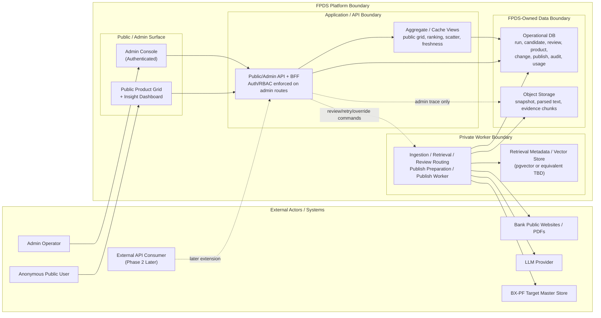

# FPDS System Context Diagram

Version: 1.0  
Date: 2026-04-01  
Status: Approved Baseline for WBS 1.4.1  
Source Documents:
- `docs/02-requirements/FPDS_Requirements_Definition_v1_5.md`
- `docs/01-planning/plan.md`
- `docs/01-planning/WBS.md`
- `docs/02-requirements/scope-baseline.md`
- `docs/03-design/workflow-state-ingestion-design.md`
- `docs/03-design/review-run-publish-audit-state-design.md`
- `docs/00-governance/decision-log.md`

---

## 1. Purpose

이 문서는 `WBS 1.4.1 시스템 컨텍스트 다이어그램 작성`을 닫기 위한 기준 문서다.

목적:
- FPDS의 외부 액터, 내부 구성요소, 저장소, 외부 연동 시스템의 경계를 한 장으로 고정한다.
- `public/admin/api/worker/storage/BX-PF` 사이의 책임 분리를 구현 전 기준으로 정리한다.
- `1.4.2 ERD`, `1.5.x API/interface`, `1.6.x security/access`가 같은 시스템 경계를 참조하도록 맞춘다.

이 문서는 논리적 시스템 컨텍스트를 정의한다.  
exact BX-PF payload, vector backend 구현 상세, admin auth 방식, CORS allowlist 값, SSRF egress allowlist 값은 후속 WBS에서 닫는다.

---

## 2. Baseline Decisions Carried Forward

본 문서는 아래 확정사항을 반영한다.

1. FPDS는 MyBank 추천 서비스가 아니라 금융상품 데이터 플랫폼이다.
2. Public surface는 익명 공개이고, Admin surface는 별도 인증이 필요한 내부 운영 영역이다.
3. FPDS는 evidence, parsed text, run/review/usage/audit/publish metadata를 소유한다.
4. 승인된 normalized product master의 target store는 BX-PF다.
5. public evidence exposure는 비범위이며, evidence trace는 admin surface에서만 조회된다.
6. worker/crawler/publish는 private boundary에서 동작해야 한다.
7. retrieval은 retrieval-ready evidence 저장까지는 고정되며, vector backend 상세는 후속 결정으로 남겨 둔다.

---

## 3. Diagram Scope

이 다이어그램은 `Prototype + Phase 1` 기준의 현재 시스템 경계를 닫는다.

포함:
- Anonymous Public User
- Admin Operator
- FPDS public/admin web surface
- FPDS public/admin API boundary
- FPDS private worker/orchestration boundary
- FPDS-owned storage and operational data boundary
- external source sites, LLM provider, BX-PF

의도적으로 단순화:
- Phase 2 External SaaS/Open API는 현재 활성 경계가 아니라 later extension으로만 표기한다.
- auth vendor, queue product, vector engine, cloud product명은 logical boundary 수준으로만 표현한다.

---

## 4. System Context Diagram

---

## 5. Boundary Interpretation

### 5.1 External Actor Boundary

- `Anonymous Public User`는 로그인 없이 public web surface만 사용한다.
- `Admin Operator`는 인증 후 admin console을 통해 review, trace, run, publish, usage 정보를 다룬다.
- `Bank Public Websites / PDFs`는 worker가 수집하는 source boundary다.
- `LLM Provider`는 extraction/normalization 보조를 수행하는 외부 reasoning provider이며, system of record가 아니다.
- `BX-PF`는 approved normalized product master의 target store다.

### 5.2 FPDS Surface Boundary

- Public과 Admin은 같은 FPDS 제품군이지만 신뢰 수준이 다르다.
- Public은 aggregate 중심 읽기 경계다.
- Admin은 review/trace/run/publish/usage를 다루는 운영 경계다.
- Public evidence 직접 노출은 금지하고, admin trace에서만 evidence 접근을 허용한다.

### 5.3 API Boundary

- API boundary는 public read API와 admin protected API를 함께 포함한다.
- admin route에서는 auth/RBAC enforcement가 필수다.
- API는 canonical/operational data를 직접 조회하고, public surface에는 aggregate/cached view를 제공한다.
- Admin action으로 발생하는 review/retry/override/publish control은 API를 통해 private worker 흐름과 연결된다.

### 5.4 Private Worker Boundary

- worker boundary는 discovery, fetch, parse, chunk, extraction, normalization, validation, review routing, publish preparation, publish/reconciliation 처리를 맡는다.
- worker는 외부 source, LLM provider, BX-PF와 통신하는 유일한 private integration boundary로 본다.
- crawler safe fetch, SSRF 방어, outbound allowlist는 이 boundary의 보안 정책이다.

### 5.5 Data Ownership Boundary

- `Operational DB`는 run/review/product/change/publish/audit/usage 같은 운영 truth를 저장한다.
- `Object Storage`는 raw snapshot, parsed text, evidence chunk를 저장한다.
- `Retrieval Metadata / Vector Store`는 retrieval-ready evidence를 찾기 위한 보조 저장소다.
- FPDS는 operational truth를 소유하지만, approved normalized master의 최종 target은 BX-PF다.

---

## 6. Open Items Not Blocking This Diagram

아래 항목은 이 다이어그램을 막지 않지만 후속 WBS에서 닫아야 한다.

| Area | Open Item | Follow-Up WBS | Why It Does Not Block 1.4.1 |
|---|---|---|---|
| Auth | session cookie vs token | `1.6.1` | 현재는 admin surface가 authenticated boundary라는 점만 고정하면 된다. |
| RBAC | role matrix와 승인 권한 세부 범위 | `1.6.2` | 현재는 admin protected route와 review/publish control이 필요하다는 점만 고정하면 된다. |
| Security | CORS allowlist, SSRF egress allowlist, CSP/CSRF 세부 정책값 | `1.6.4` ~ `1.6.6` | 현재는 public/admin/api/worker 간 trust boundary만 먼저 고정하면 된다. |
| External API | exact credential enforcement and quota/rate-limit policy | `1.6.3`, `7.6` | 현재는 Phase 2 resource boundary와 tenant-aware direction만 고정하면 된다. |

---

## 7. Interfaces and Follow-On Work Unlocked

이 문서는 아래 후속 작업의 기준 입력이다.

- `1.4.2`: operational DB와 object storage 중심 ERD draft 작성
- `1.4.3`: snapshot/evidence/object storage 정책 상세화
- `1.4.4`: retrieval/vector backend starting point 확정
- `1.4.6`: dev/prod 및 private worker boundary 환경 분리 설계
- `1.5.1`: public API contract 구체화
- `1.5.2`: admin API contract 구체화
- `1.5.3`: internal orchestration interface 구체화
- `1.5.4`: BX-PF write contract 초안 구체화
- `1.5.5`: external SaaS/Open API resource draft 구체화
- `1.6.x`: auth/RBAC/CORS/SSRF/security header 정책 구체화

---

## 8. WBS Mapping

| WBS ID | Closure in This Document |
|---|---|
| 1.4.1 | Sections 2-7 |

---

## 9. Change History

| Date | Change |
|---|---|
| 2026-04-01 | Initial system context diagram baseline created for WBS 1.4.1 |
